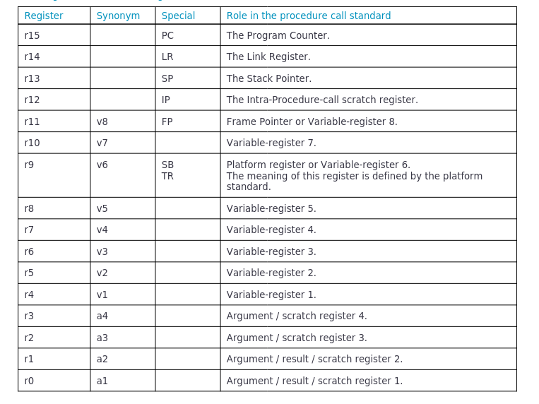

# ARM AArch32 ABI Convention

link: [https://github.com/ARM-software/abi-aa/blob/main/aapcs32/aapcs32.rst](https://github.com/ARM-software/abi-aa/blob/main/aapcs32/aapcs32.rst)

Registers R0-3 are also, by convention, used to hold parameter values to be passed to a subroutine or function. Functions with more than four parameters typically use one or more of those parameter registers to hold addresses pointing to data structures in memory.