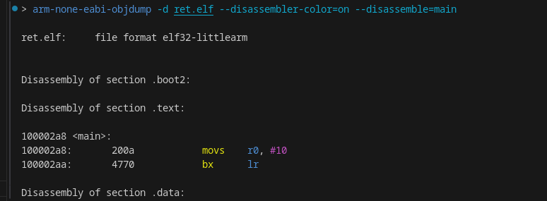

Branch exchange (BX)
====================

consider this simple code

.. code-block:: c
        
        int main() {
                /* nop */
                return 10;
        }

produces this:

It's almost always returning from a function, like ret in some other ISAs like AArch64.

nice read:

* `BX instruction (ARM Developer Documentation) <https://developer.arm.com/documentation/dui0379/e/arm-and-thumb-instructions/bx>`__
* `B and BL instructions (ARM Instruction Reference) <https://developer.arm.com/documentation/dui0231/b/arm-instruction-reference/arm-branch-instructions/b-and-bl>`__
