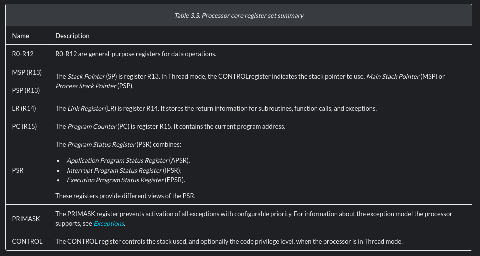

# ARM M0+ registers

nice read: [https://blog.smittytone.net/2022/06/19/get-started-with-arm-assembly-on-the-pi-pico/](https://blog.smittytone.net/2022/06/19/get-started-with-arm-assembly-on-the-pi-pico/)

secara formal, arm M0 punya register2 berikut
```
* r0
* r1
* r2
* r3
* r4
* r5
* r6
* r7
* r8
* r9
* r10
* r11
* r12
* sp (aka r13)
* lr (aka r14)
* pc (aka r15)
* xPSR
* msp
* psp
```

official docs: [https://developer.arm.com/documentation/ddi0484/c/Programmers-Model/Processor-core-registers-summary](https://developer.arm.com/documentation/ddi0484/c/Programmers-Model/Processor-core-registers-summary)



intinya

- register r0 sampai r12 itu adalah GP register
- r13 dibagi jadi 2, ada Main Stack Pointer (MSP) dan Process Stack Pointer (PSP) 
- r14 adalah link register
- pc (r15), program counter

