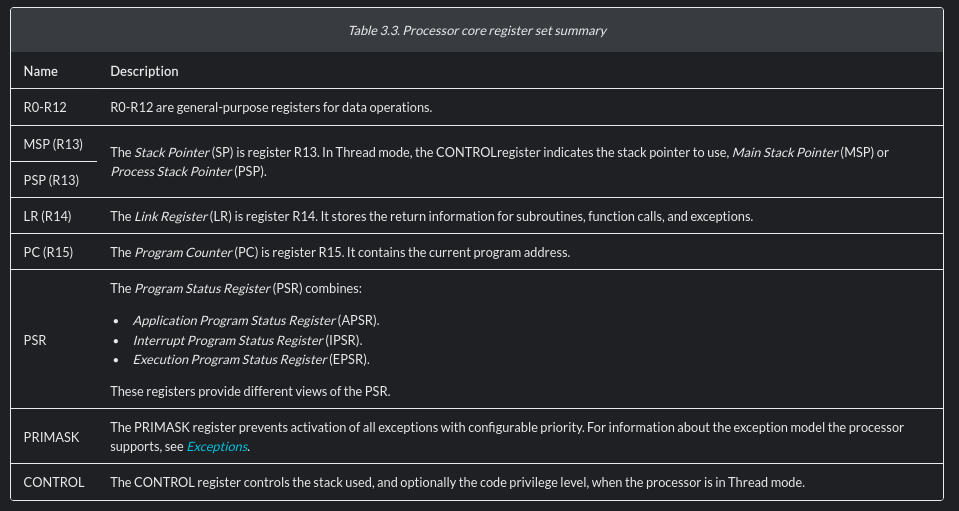

ARM M0+ registers
===================

Nice read: `Get Started with ARM Assembly on the Pi Pico <https://blog.smittytone.net/2022/06/19/get-started-with-arm-assembly-on-the-pi-pico/>`_

here ARM-M0 default register 

* r0
* r1
* r2
* r3
* r4
* r5
* r6
* r7
* r8
* r9
* r10
* r11
* r12
* sp (aka r13)
* lr (aka r14)
* pc (aka r15)
* xPSR
* msp
* psp

Official documentation: `Processor core registers summary <https://developer.arm.com/documentation/ddi0484/c/Programmers-Model/Processor-core-registers-summary>`_

Summary:

- Registers r0 to r12 are general-purpose (GP) registers.
- r13 is split into two: Main Stack Pointer (MSP) and Process Stack Pointer (PSP).
- r14 is the link register.
- pc (r15) is the program counter.

