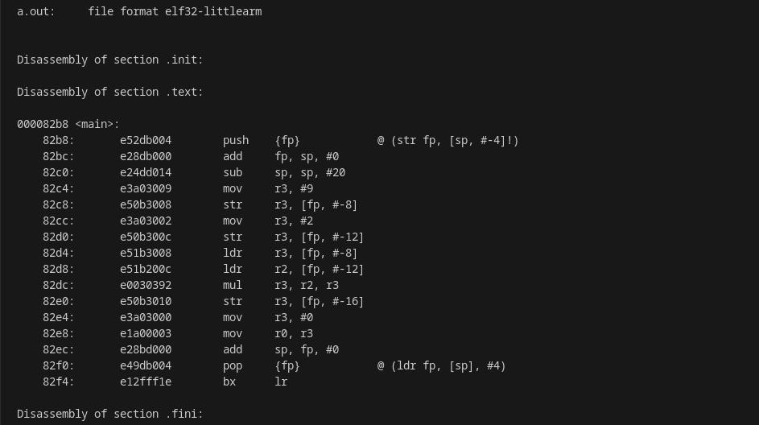
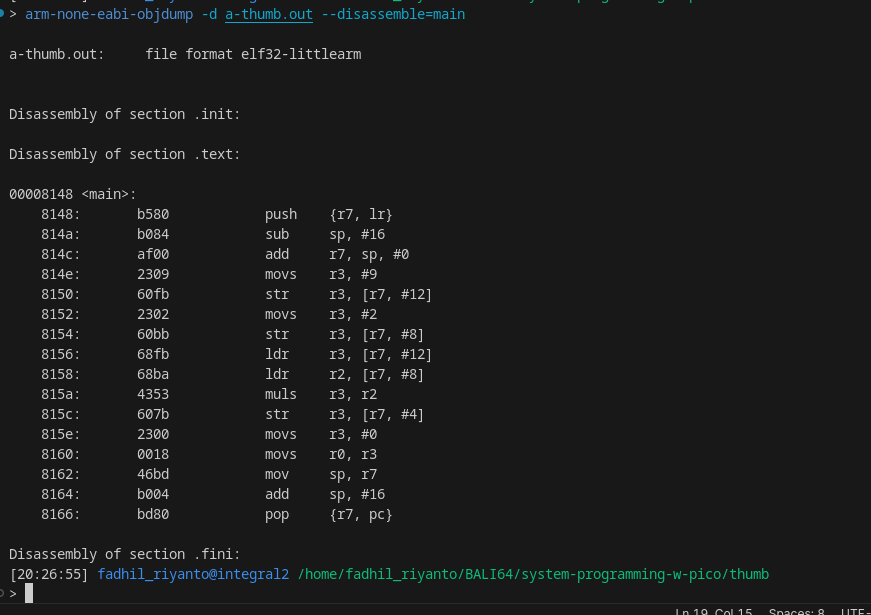

# difference between thumb-1 (T16) and normal ARM

hi, today I will show you what difference between thumb-1 and normal arm

## what is thumb-1
thumb-1 is lite version of full arm instruction, the instruction has 16 bit wide. and because if its "lite", the binary size is should be smaller compared than normal arm

normal arm has instruction wide 32 bit (idk about aarch64)

## start

tool:

- arm-none-eabi-gcc
- arm-none-eabi-objdump

first, lets compile this very simple program

```c
#define A       0xA

int _sbrk() {

}

int _write() {
        
}

int _read() {
        
}

int _lseek() {
        
}

int _close() {
        
}

int _exit() {
        
}

int main() {
        int a = 9;
        int b = 2;

        int c = a * b;
}

```

compile it for normal arm, the output binary I call it as `a.out`

```sh
arm-none-eabi-gcc test_asm.c
```

objdump it
```sh
arm-none-eabi-objdump -d a.out --disassemble=main
```



# thumb-1
the instruction should be 16 bit wide

```sh
arm-none-eabi-gcc test_asm.c -mthumb -mcpu=cortex-m0plus -o a-thumb.out
arm-none-eabi-objdump -d a-thumb.out --disassemble=main
```



see?