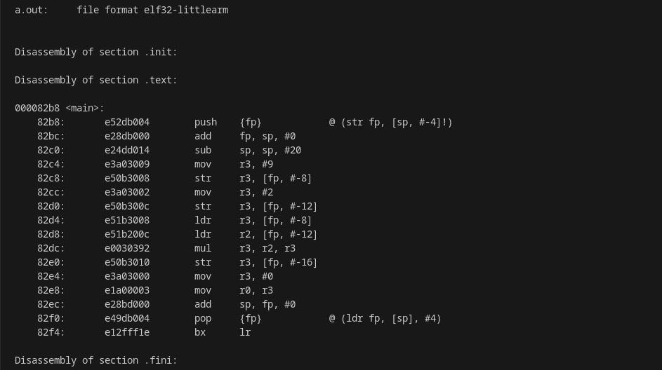
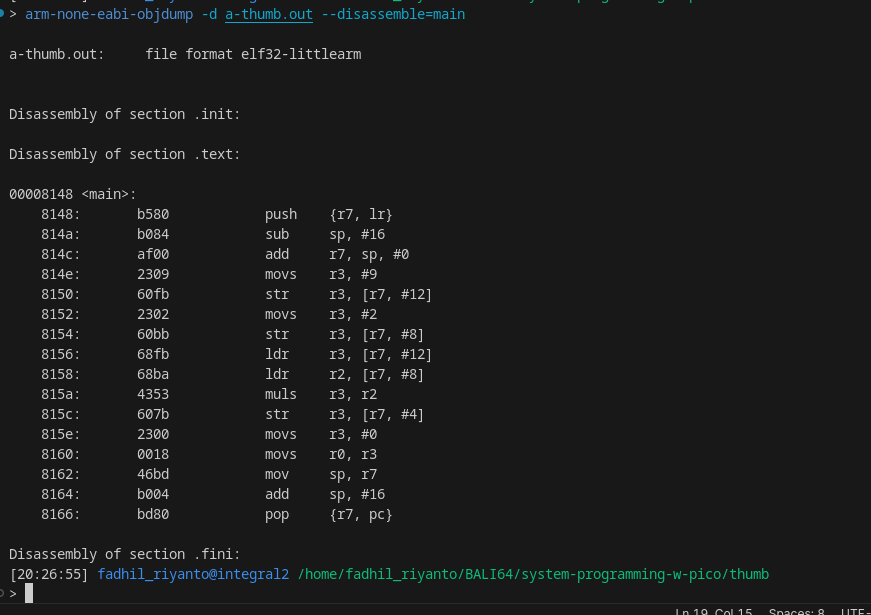

Difference Between Thumb-1 (T16) and Normal ARM
===============================================

Introduction
------------

This document explains the differences between Thumb-1 and normal ARM instruction sets.

What is Thumb-1?
----------------

Thumb-1 is a lightweight version of the full ARM instruction set. Thumb-1 instructions are 16 bits wide, resulting in smaller binary sizes compared to normal ARM instructions, which are 32 bits wide. (Note: AArch64 is not covered here.)

Lab setup
---------

Tools required:

- ``arm-none-eabi-gcc``
- ``arm-none-eabi-objdump``

First, compile the following simple program:

.. code-block:: c

        #define A       0xA

        int _sbrk() {

        }

        int _write() {

        }

        int _read() {

        }

        int _lseek() {

        }

        int _close() {

        }

        int _exit() {

        }

        int main() {
                int a = 9;
                int b = 2;

                int c = a * b;
        }

Compile for normal ARM. The output binary is called ``a.out``:

.. code-block:: sh

        arm-none-eabi-gcc test_asm.c

Disassemble the binary:

.. code-block:: sh

        arm-none-eabi-objdump -d a.out --disassemble=main

Thumb-1
-------

Thumb-1 instructions are 16 bits wide.

Compile and disassemble for Thumb-1:

.. code-block:: sh

        arm-none-eabi-gcc test_asm.c -mthumb -mcpu=cortex-m0plus -o a-thumb.out
        arm-none-eabi-objdump -d a-thumb.out --disassemble=main

See the difference?