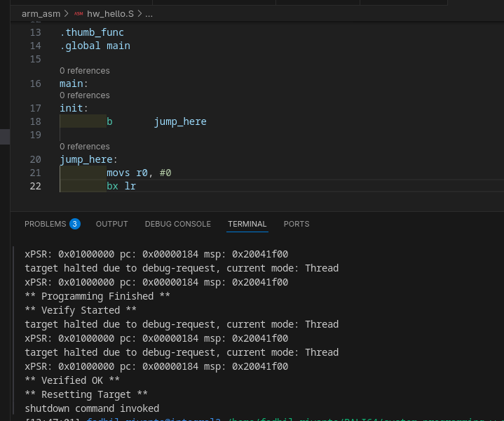
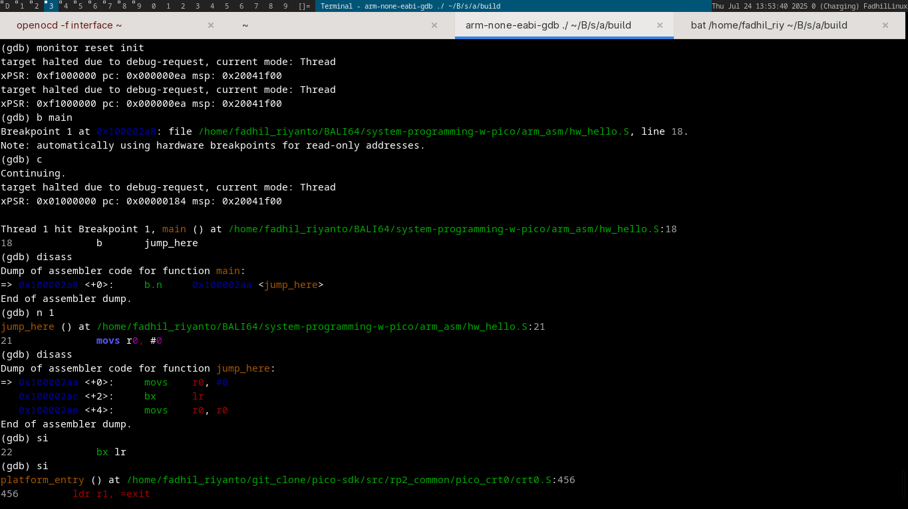
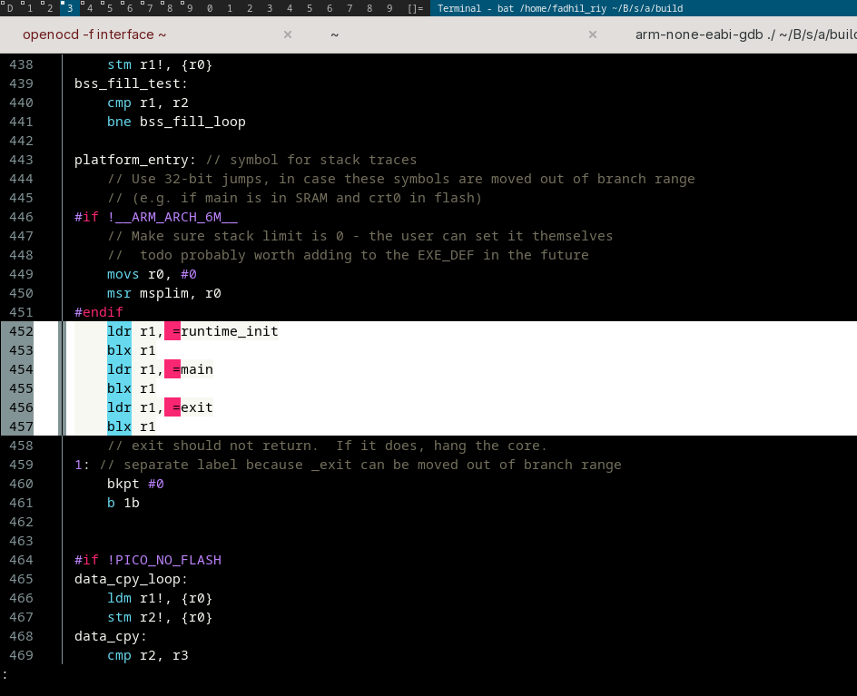

# calling a main function

disini, ku akan memperlihatkan "kenapa" init function di rp2040 bisa bernama main, dan bagaimana steps nya

pertama2, saya mencoba flash kode asm yang isinya hanya jump dan exit, seperti yang terlihat dibawah


lalu saya jalankan, terlihat saya kasih dia breakpoint di `main` kan?


sebenernya sudah benar bagian

```c
(gdb) disass
Dump of assembler code for function main:
=> 0x100002a8 <+0>:	b.n	0x100002aa <jump_here>
```

lalu next, jump ke `jump_here`

```c
(gdb) disass
Dump of assembler code for function jump_here:
=> 0x100002aa <+0>:	movs	r0, #0
   0x100002ac <+2>:	bx	lr
   0x100002ae <+4>:	movs	r0, r0
End of assembler dump.

```

terlihat sudah sampai di `movs r0, #0` kan? sama seperti assembly kita diatas, tapi ada beberapa yang strange (need triage)

tiba tiba muncul
```c
movs	r0, r0
```

jika kita lihat juga, setelah jump `jump_here` dieksekusi, ia pindah ke `/home/fadhil_riyanto/git_clone/pico-sdk/src/rp2_common/pico_crt0/crt0.S:456`

dan akhirnya, tidak sengaja menemukan asm yang memanggil si main

