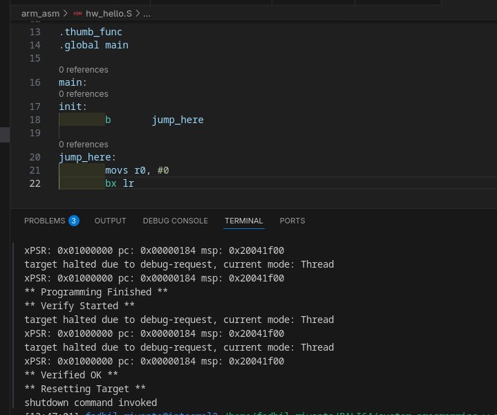
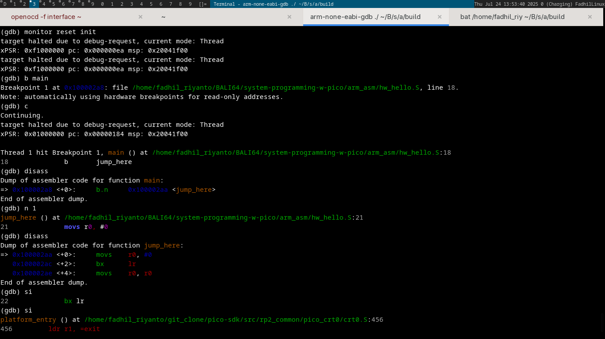
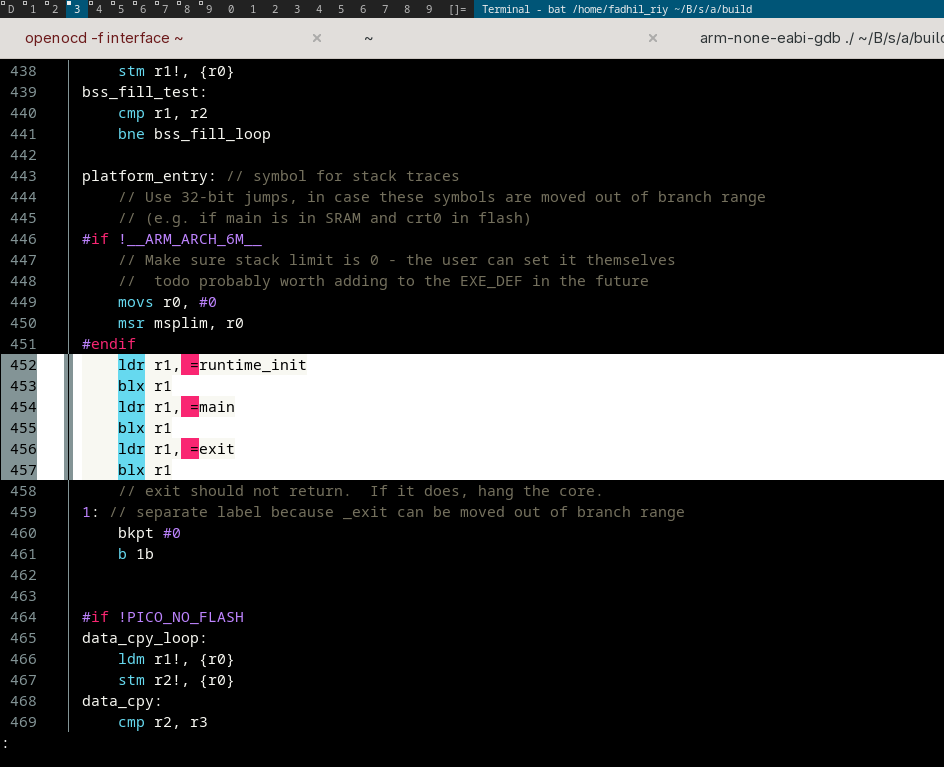

Calling a main function
=======================

Di sini, saya akan memperlihatkan *kenapa* fungsi `init` di RP2040 bisa bernama `main`, dan bagaimana langkah-langkahnya.

Pertama-tama, saya mencoba mem-flash kode asm yang isinya hanya *jump* dan *exit*, seperti yang terlihat di bawah:

Lalu saya jalankan, terlihat saya memberi breakpoint di `main`, bukan?

Sebenarnya sudah benar bagian berikut:

.. code-block:: c

   (gdb) disass
   Dump of assembler code for function main:
   => 0x100002a8 <+0>:	b.n	0x100002aa <jump_here>

Selanjutnya, *jump* ke `jump_here`:

.. code-block::

   (gdb) disass
   Dump of assembler code for function jump_here:
   => 0x100002aa <+0>:	movs	r0, #0
      0x100002ac <+2>:	bx	lr
      0x100002ae <+4>:	movs	r0, r0
   End of assembler dump.

Terlihat sudah sampai di `movs r0, #0`, sama seperti assembly kita di atas, tapi ada beberapa hal yang aneh (*need triage*).

Tiba-tiba muncul:

.. code-block:: c

   movs	r0, r0

Jika kita lihat juga, setelah *jump* `jump_here` dieksekusi, ia pindah ke:

   /home/fadhil_riyanto/git_clone/pico-sdk/src/rp2_common/pico_crt0/crt0.S:456

Akhirnya, tidak sengaja menemukan asm yang memanggil si `main`:

