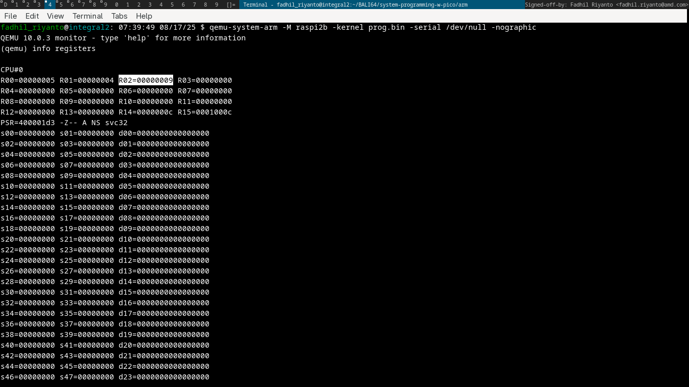

# Rasberry PI bare metal kernel lab setup

today is 17 august, 2025
lets make small kernel that only can doing addition.

# assembly

```asm
        .text
start:
        mov r0, #5
        mov r1, #4
        add r2, r1, r0

stop:   b stop
```

compile it with

- `arm-none-eabi-as -mcpu=cortex-a7 -o prog.o hello_aarch64.S`
- `arm-none-eabi-ld -Ttext=0x8000 -o prog.elf prog.o`
- `arm-none-eabi-objcopy -O binary prog.elf prog.bin`

run it
- `qemu-system-arm -M raspi2b -kernel prog.bin -serial /dev/null -nographic`

here the R2

