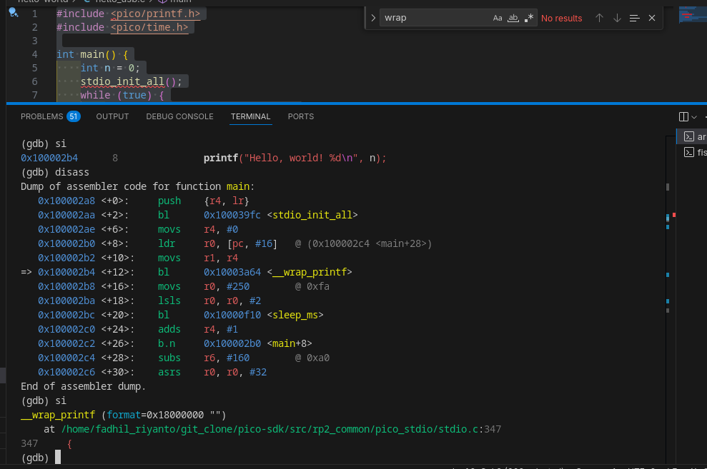
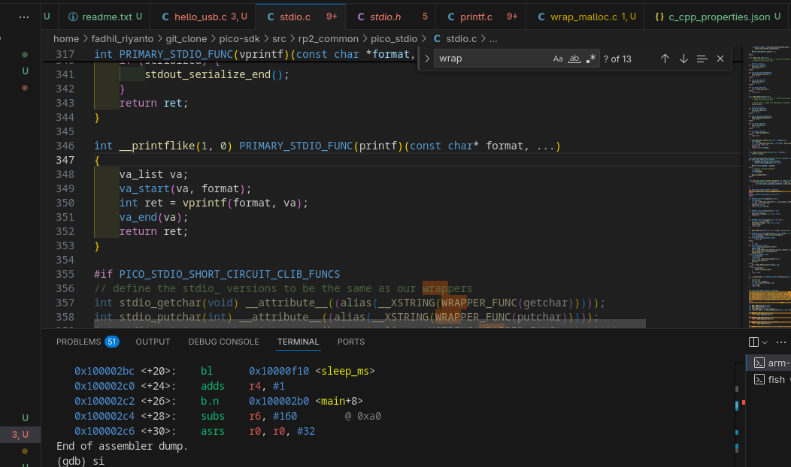
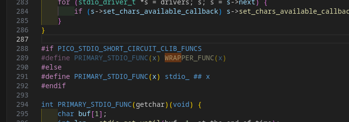
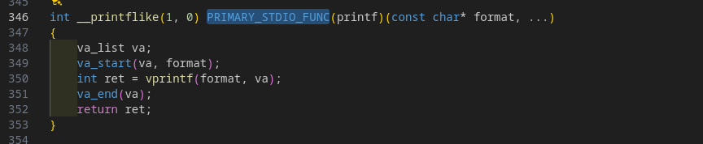

Analysis: How printf Works on RP2040 at a Low Level
===================================================

In order to understand how ``printf`` works in the RP2040 UART bridge, let's compile a simple program, build it with debug symbols, and then run GDB.

Consider this very simple Hello World example:

.. code-block:: c

        #include <pico/printf.h>
        #include <pico/time.h>

        int main() {
                int n = 0;
                stdio_init_all();
                while (true) {
                        printf("Hello, world! %d\n", n);
                        sleep_ms(1000);
                        n = n + 1;
                }
        }

Analysis
--------

See?

.. code-block:: c

        => 0x100002b4 <+12>:    bl      0x10003a64 <__wrap_printf>

It calls ``__wrap_printf``, which means the backend uses ``-Wl,--wrap=printf`` internally. If we refer to ``/home/fadhil_riyanto/git_clone/pico-sdk/src/rp2_common/pico_stdio/stdio.c:347``:

The signature is different. This function has the signature:

.. code-block:: c

        int __printflike(1, 0) PRIMARY_STDIO_FUNC(printf)(const char* format, ...)

So, what exactly happens?

Result
------

Let's look at ``stdio.c`` line 289:

When the macro ``PICO_STDIO_SHORT_CIRCUIT_CLIB_FUNCS`` is active, we replace the function name by ``WRAPPER_FUNC(x)``, not ``stdio_printf``.

After that, let's jump into the `pico-sdk compiler.h <https://github.com/raspberrypi/pico-sdk/blob/9a4113fbbae65ee82d8cd6537963bc3d3b14bcca/src/rp2_common/pico_platform_compiler/include/pico/platform/compiler.h#L185>`_ for a very clear definition.

So, basically, this function:

calls ``__wrap_printf``.

Make sense?
