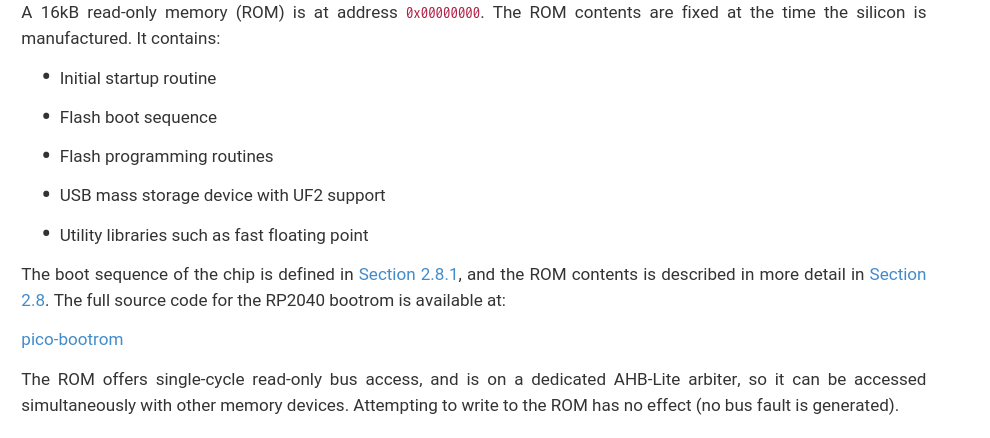
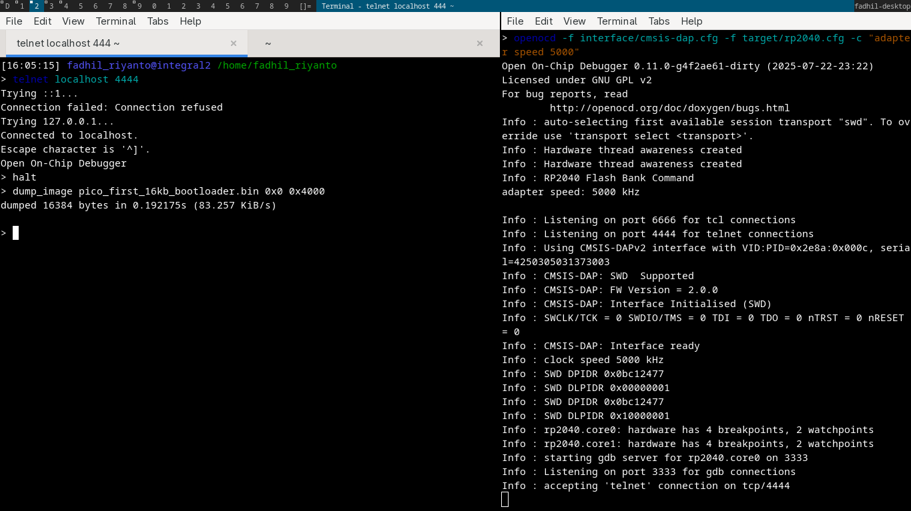
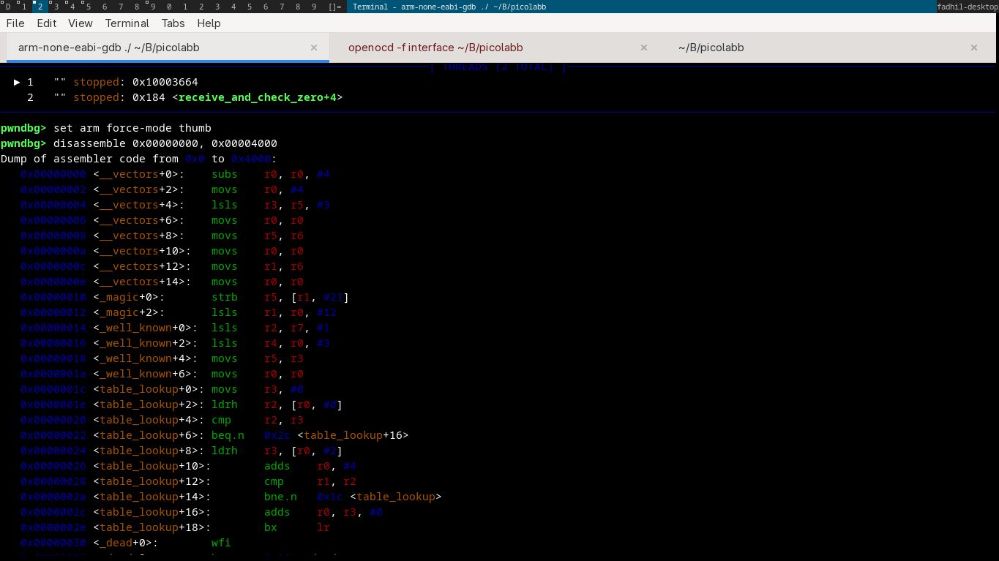
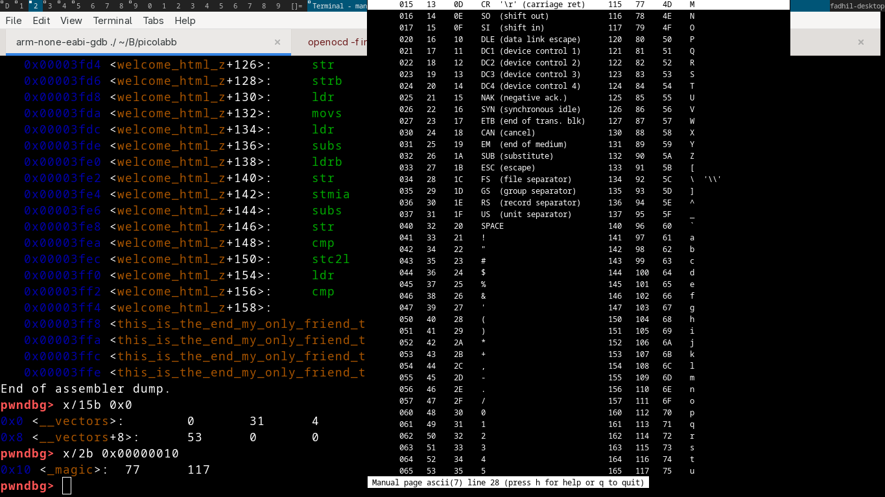

# dump firmware for from 0x0 ~ 0x4000

this is how you can dump first 16Kbytes

based on this docs, its feel intresting look inside about rom



let's dump it

# openocd

this tutorial uses secondary pico, which connected with other pico's

```
openocd -f interface/cmsis-dap.cfg -f target/rp2040.cfg -c "adapter speed 5000"
```

after it

```
telnet localhost 4444
> halt
> dump_image pico_first_16kb_bootloader.bin 0x0 0x4000
```

show the binary

```sh
arm-none-eabi-objdump -D -b binary -marm -Mforce-thumb ./pico_first_16kb_bootloader.bin
```



# another way

let's use GDB stuff, first download [this](https://github.com/raspberrypi/pico-bootrom-rp2040/releases/tag/b2), run as regular gdb debug mode + openocd. then dump



here the intresting part



which part of [https://github.com/raspberrypi/pico-bootrom-rp2040/blob/ef22cd8ede5bc007f81d7f2416b48db90f313434/bootrom/bootrom_rt0.S#L48](https://github.com/raspberrypi/pico-bootrom-rp2040/blob/ef22cd8ede5bc007f81d7f2416b48db90f313434/bootrom/bootrom_rt0.S#L48)