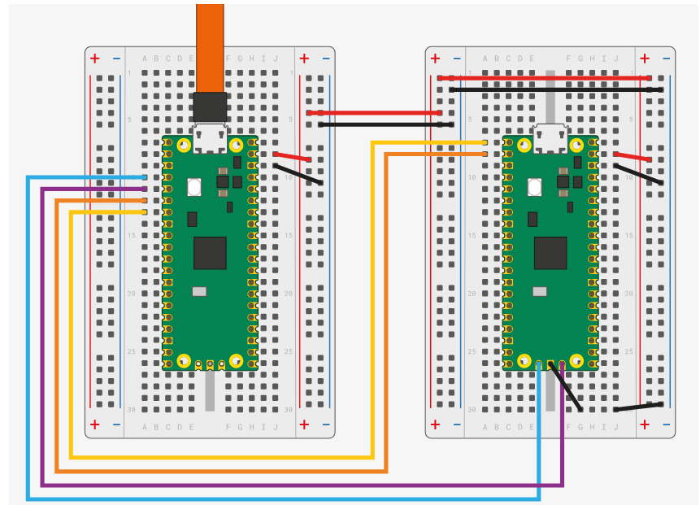
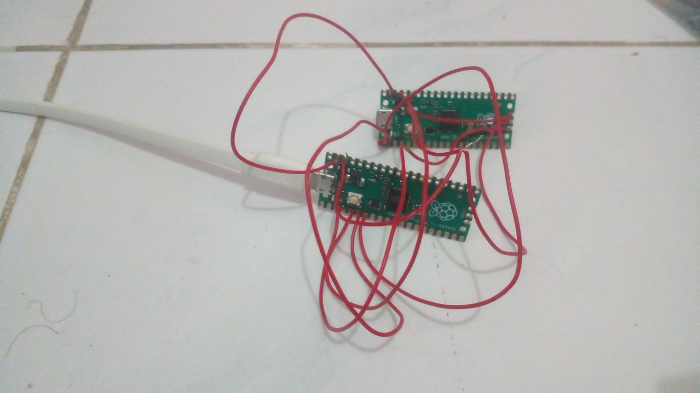

# debug pico with another pico

first, we need a patch this stuff https://review.openocd.org/c/openocd/+/8223/3/src/flash/nor/spi.c#187

# optional dry run
```sh
pacman -S mingw-w64-x86_64-toolchain git make libtool pkg-config autoconf automake texinfo mingw-w64-x86_64-libusb
```

then run

```sh
git clone https://github.com/raspberrypi/openocd.git --branch picoprobe --depth=1
cd openocd
nvim /src/flash/nor/spi.c
```

then add patch

after that

# build

```sh
./bootstrap
./configure --enable-picoprobe --disable-werror
make -j4
sudo make install
```

# flash ELF
```sh
sudo openocd -f interface/cmsis-dap.cfg -f target/rp2040.cfg -c "adapter speed 5000" -c "program blink.elf verify reset exit"
```

# just debugging
```sh
sudo openocd -f interface/cmsis-dap.cfg -f target/rp2040.cfg -c "adapter speed 5000"

```sh
arm-none-eabi-gdb blink.elf
> target remote localhost:3333
> monitor reset init
> continue
```

wiring position: 

