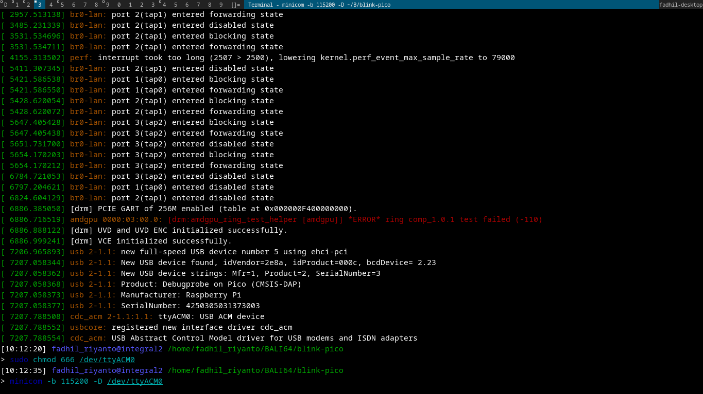

# PICO SDK install & cmake template

install step is very easy, 

```sh
git clone https://github.com/raspberrypi/pico-sdk.git
cd pico-sdk
git submodule update --init
```

# CMAKE Template

this is my own standard of pico rp2040 chip cmake build template

```C
cmake_minimum_required(VERSION 3.13)
set(CMAKE_EXPORT_COMPILE_COMMANDS ON)

include(/home/fadhil_riyanto/git_clone/pico-sdk/pico_sdk_init.cmake)

pico_sdk_init()

project(hello_usb C CXX ASM)
set(CMAKE_C_STANDARD 11)
set(CMAKE_CXX_STANDARD 17)


add_executable(hello_usb hello_usb.c)
target_link_libraries(hello_usb pico_stdlib)

# # enable usb output, disable uart output
# pico_enable_stdio_usb(hello_usb 1)
# pico_enable_stdio_uart(hello_usb 0)

pico_add_extra_outputs(hello_usb)
```
if you ask about 

>> what uses of `pico_sdk_init`, or `pico_enable_stdio_usb`, please read it yourself on [https://github.com/raspberrypi/pico-sdk/blob/9a4113fbbae65ee82d8cd6537963bc3d3b14bcca/pico_sdk_init.cmake#L44-L49](https://github.com/raspberrypi/pico-sdk/blob/9a4113fbbae65ee82d8cd6537963bc3d3b14bcca/pico_sdk_init.cmake#L44-L49), thats is a macro!

feel free to change `include(/home/fadhil_riyanto/git_clone/pico-sdk/pico_sdk_init.cmake)` with your own SDK Path




# vscode autocomplete settings

create file named `.vscode/c_cpp_properties.json`

fill with

```json
{
  "configurations": [
    {
      "name": "Linux",
      "compileCommands": "${workspaceFolder}/build/compile_commands.json",
      "intelliSenseMode": "linux-gcc-x64",
      "compilerPath": "/usr/bin/g++",
      "cStandard": "c11",
      "cppStandard": "c++17"
    }
  ],
  "version": 4
}

```