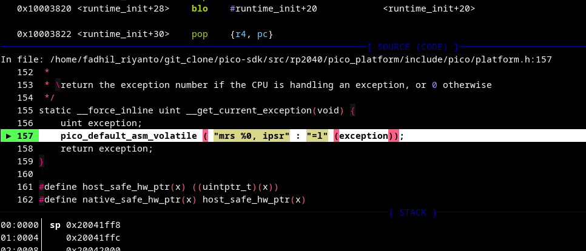
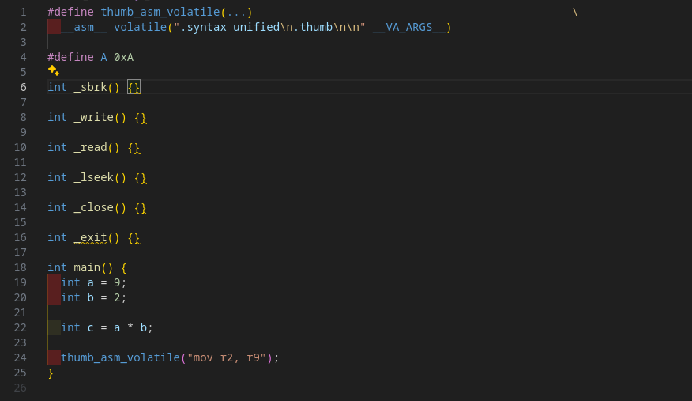
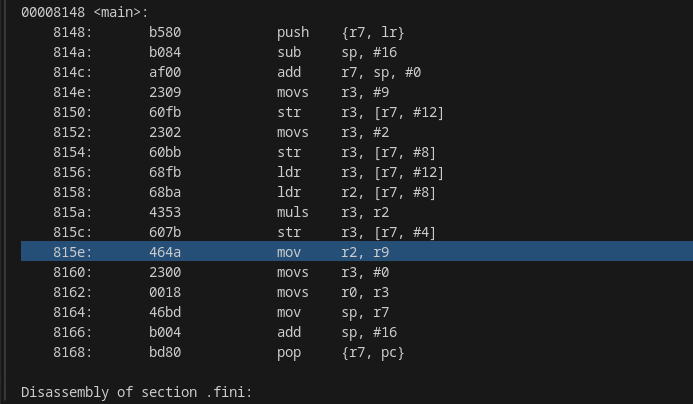

# pico_default_asm_volatile

after a long time, I discover this macro from this screenshoot



and I found it

[https://github.com/raspberrypi/pico-sdk/blob/9a4113fbbae65ee82d8cd6537963bc3d3b14bcca/src/rp2_common/pico_platform_compiler/include/pico/platform/compiler.h#L149-L159](https://github.com/raspberrypi/pico-sdk/blob/9a4113fbbae65ee82d8cd6537963bc3d3b14bcca/src/rp2_common/pico_platform_compiler/include/pico/platform/compiler.h#L149-L159)


```c
#define pico_default_asm_volatile(...) __asm volatile (".syntax unified\n" __VA_ARGS__)
```
and the explanation why use `__VA_ARGS__`: [https://gcc.gnu.org/onlinedocs/cpp/Variadic-Macros.html](https://gcc.gnu.org/onlinedocs/cpp/Variadic-Macros.html)

here the example



