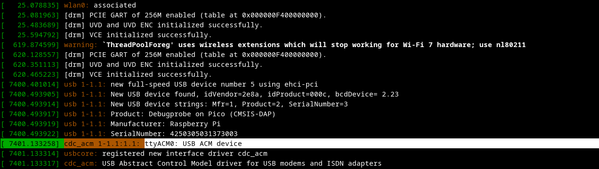
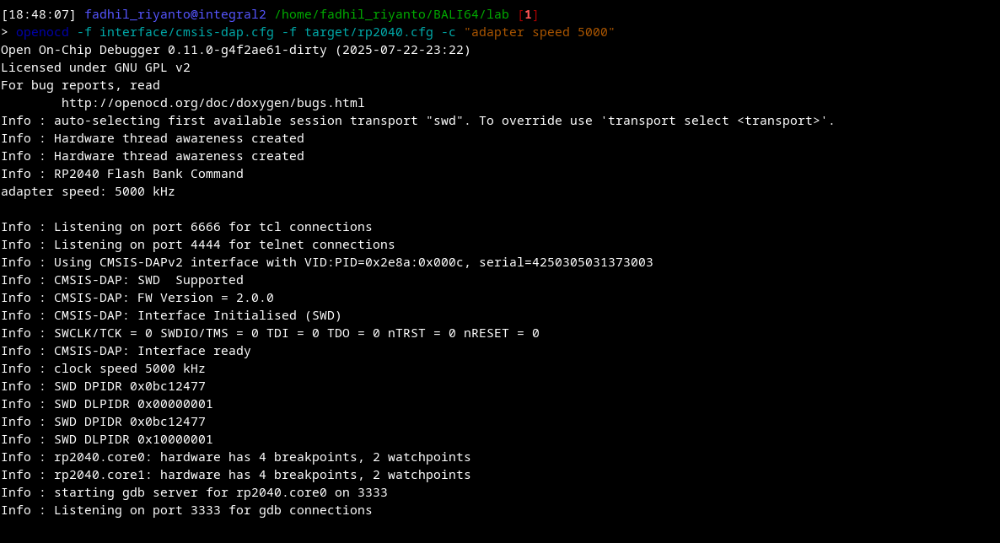
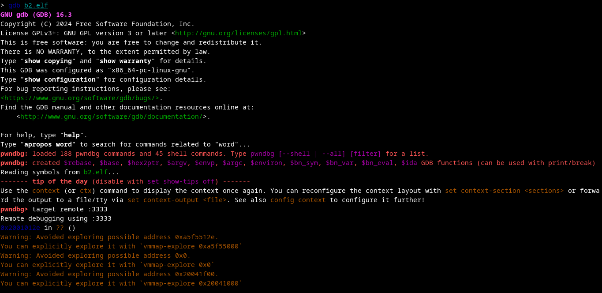
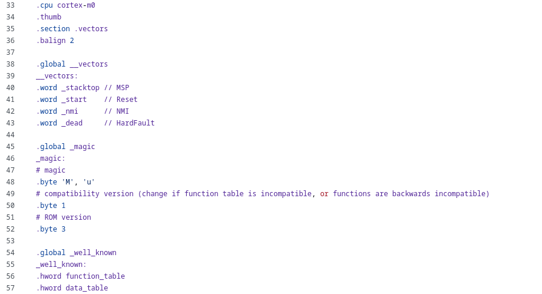
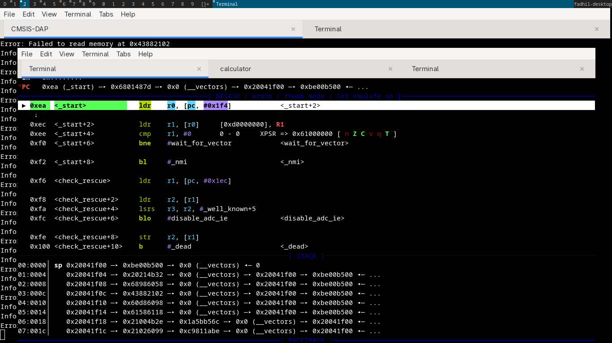
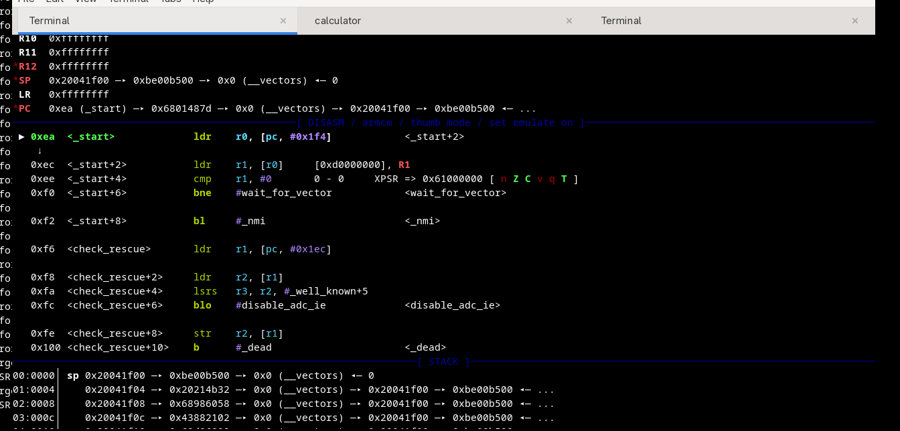
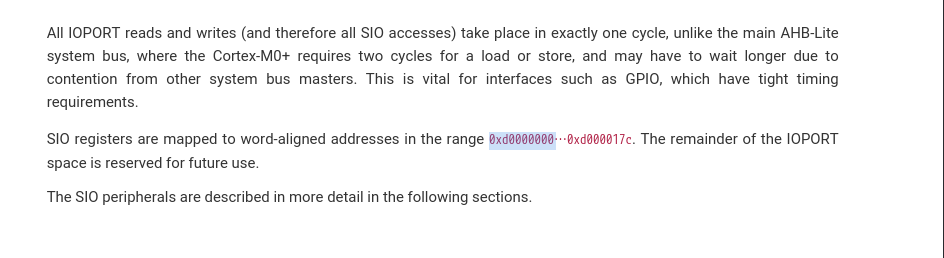
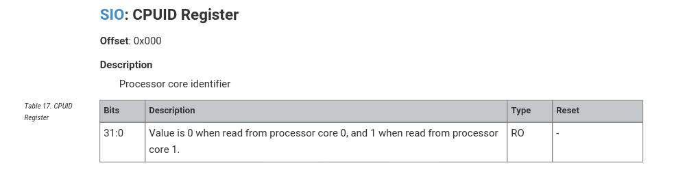

RP2040 BOOT version 2
=====================

this series is some sorts of completion of :doc:`rp2040-boot`

This below is the sequence how RP2040 chip is actually boot, until we hit main function. 
The Bootrom size is limited to 16kB. It contains

- Processor core 0 initial boot sequence
- Processor core 1 low power wait and launch protocol
- USB MSC class-compliant bootloader with UF2 support for downloading code/data to FLASH or RAM
- USB PICOBOOT bootloader interface for advanced management

nvm, let's take how rp2040 is boot.

lab setup
---------
let's download the bootrom binary code first

.. code:: sh

        wget https://github.com/raspberrypi/pico-bootrom-rp2040/releases/download/b2/b2.elf

why I should download the ``b2.elf`` first? because the bootrom code iself is "baked" into silicon metal, and unlike
the normal program that we can flash custom code, the bootrom is fixed. this is the reason
why we need a .elf, because we want do something with binary in the chip, and the elf itself is
just a "map" for us.

before all happens, let's find your RP2040 SWD to USB device driver, im on ``/dev/ttyACM0``

firing our openocd (the debugger)

step 1
------
load your b2.elf into gdb 

after it, let's analyze the source code 

- https://github.com/raspberrypi/pico-bootrom-rp2040/blob/ef22cd8ede5bc007f81d7f2416b48db90f313434/CMakeLists.txt#L39, this confirm us that ``bootrom/bootrom_rt0.S``
  is used. let's check it

step 2
------
verifying if "that is actually" the bootloader, by dumping its assembly and compare it with real source code

here real source code

step 3
------
walk through bootloader 

how I can find 0xea offsets? this is very simple.

.. code-block:: 

  pwndbg> monitor reset init
  target halted due to debug-request, current mode: Thread 
  xPSR: 0xf1000000 pc: 0x000000ea msp: 0x20041f00
  target halted due to debug-request, current mode: Thread 
  xPSR: 0xf1000000 pc: 0x000000ea msp: 0x20041f00

note:

xPSR is a x program status register, contains
  - Application Program Status Register
  - Interrupt Program Status Register
  - Execution Program Status Register
  

I will cover this later, but let's see the ``pc``, it show us that 0xea is next instruction, let's add
hardware breakpoint here. 

step 4
------
processor controlled boot sequence, here how rp2040 is boot

walk 0
^^^^^^
Reset to both processors released: both enter ROM at same location

walk 1
^^^^^^
Processors check SIO.CPUID
here the link: https://github.com/raspberrypi/pico-bootrom-rp2040/blob/ef22cd8ede5bc007f81d7f2416b48db90f313434/bootrom/bootrom_rt0.S#L233

because the SIO register is word-aligned and started from address 0xd0000000, so let's deep dive in this

after it, this asm code is launched by both processor, TL;DR. if core0, go ahead, if core1 go to sleep.

.. code-block::

    check_core:
        // NOTE: We DO NOT use any stack prior to possible watchdog entry (this includes NMI vector handler)
        ldr r0, =SIO_BASE
        ldr r1, [r0, #SIO_CPUID_OFFSET]
        cmp r1, #0

this code show us that 
- load 0xd0000000 into r0 
- then, compute r0 + CPUDID_OFFSET, which 

- then, store the result into r1 
    
.. note::

  because the docs itself say "Value is 0 when read from processor core 0, and 1 when read from processor core 1.", so we need to check if r1 is equal with 0. we do this with ``cmp r1, #0``

other cond, when its not a core0, jump to :ref:`here <wait_for_vector>` 

.. _wait_for_vector:

https://github.com/raspberrypi/pico-bootrom-rp2040/blob/ef22cd8ede5bc007f81d7f2416b48db90f313434/bootrom/bootrom_rt0.S#L329

walk 2
^^^^^^
If power up event was from Rescue DP, clear this flag and halt immediately

I think this code do best job: https://github.com/raspberrypi/pico-bootrom-rp2040/blob/ef22cd8ede5bc007f81d7f2416b48db90f313434/bootrom/bootrom_rt0.S#L248-L260