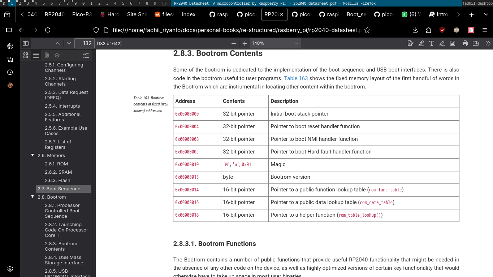
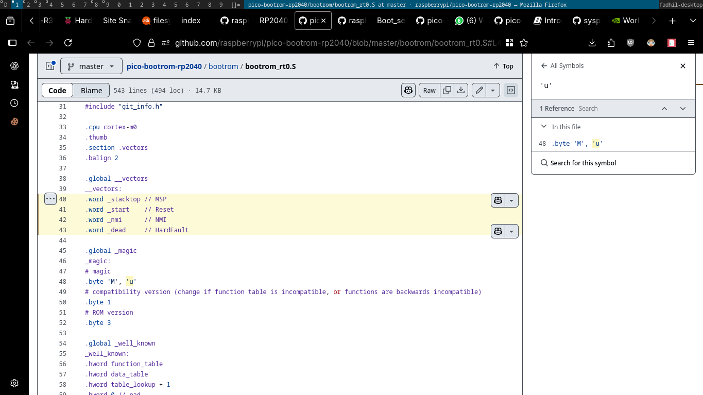
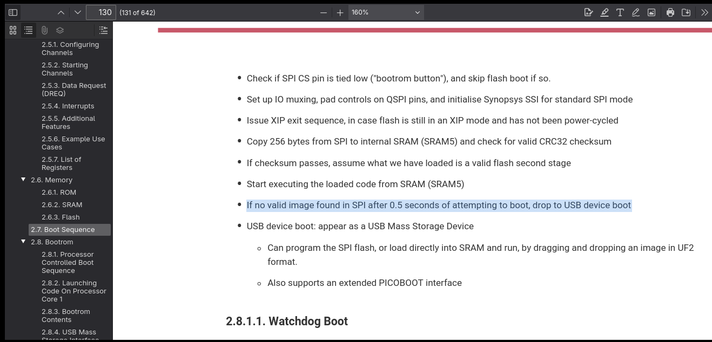
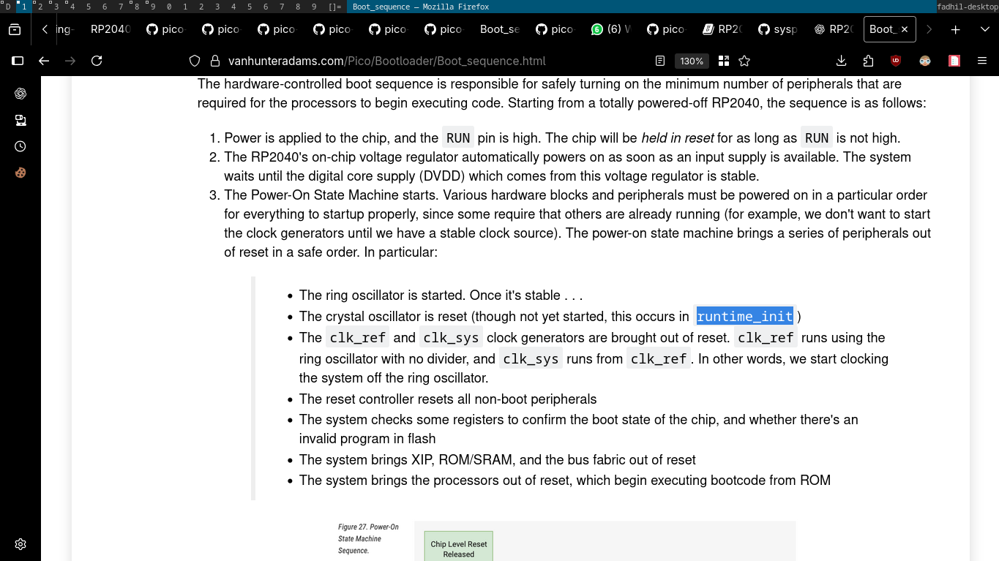
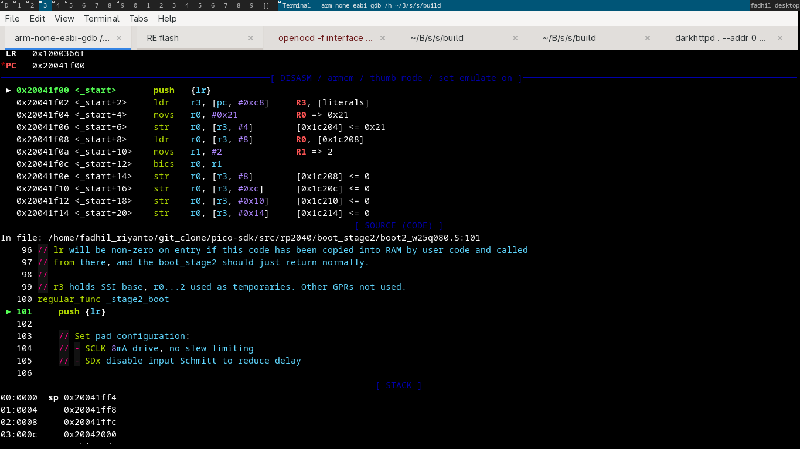
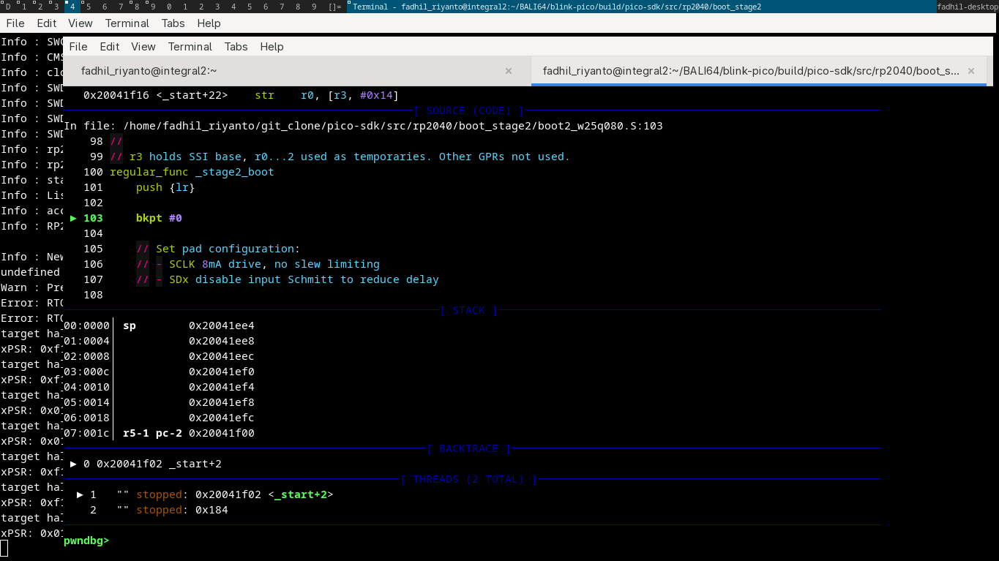
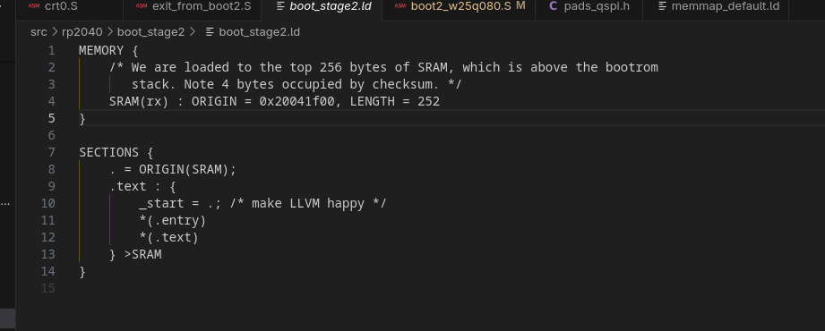
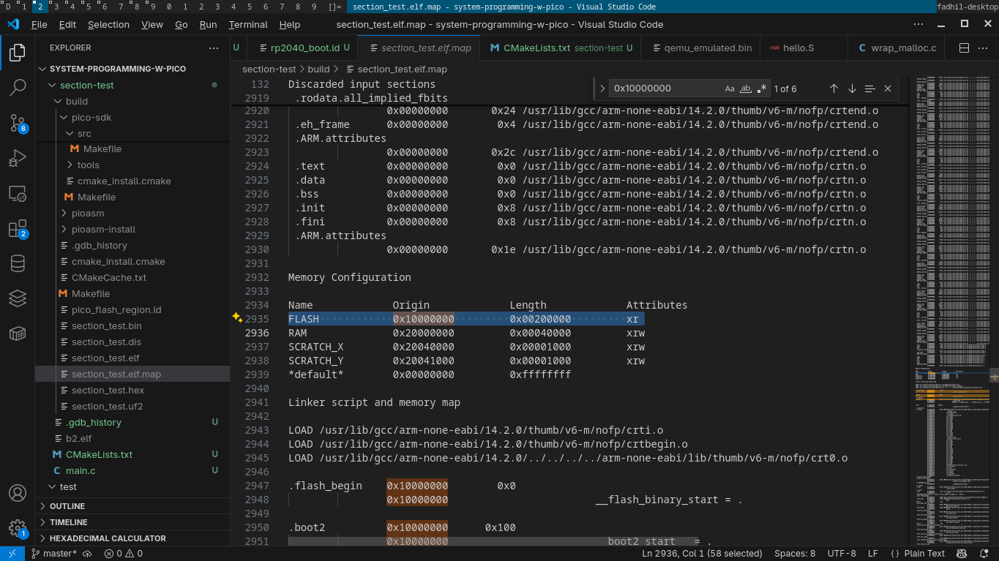
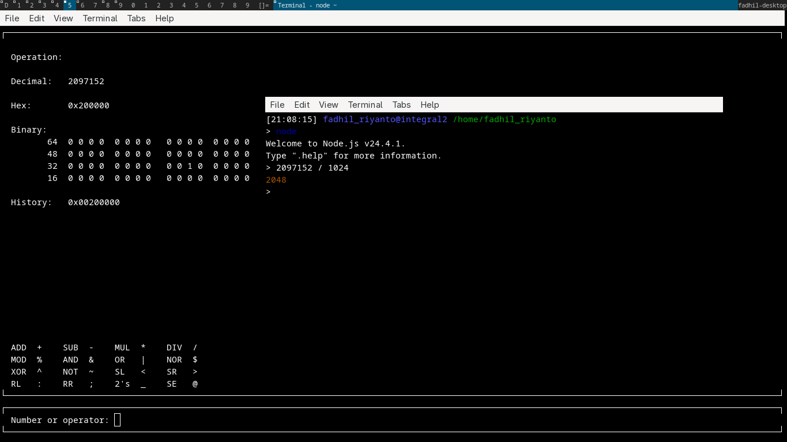

# RP2040 boot

first, lets look at this docs



I'll prove this

- 1st, please look at this cmake, they says `bootrom_rt0.S`, which is [https://github.com/raspberrypi/pico-bootrom-rp2040/blob/ef22cd8ede5bc007f81d7f2416b48db90f313434/CMakeLists.txt#L39](https://github.com/raspberrypi/pico-bootrom-rp2040/blob/ef22cd8ede5bc007f81d7f2416b48db90f313434/CMakeLists.txt#L39)
- 2nd, the contents


# the strange header

in `bootrom_rt0.S` contains a strange header like this


```c
#include "hardware/regs/addressmap.h"
#include "hardware/regs/pads_bank0.h"
#include "hardware/regs/resets.h"
#include "hardware/regs/sio.h"
#include "hardware/regs/watchdog.h"
#include "hardware/regs/syscfg.h"
#include "hardware/regs/clocks.h"
#include "hardware/regs/vreg_and_chip_reset.h"
#include "hardware/regs/m0plus.h"
#include "git_info.h"
```

warn:
this is just my speculation, the real location is in [https://github.com/raspberrypi/pico-sdk/tree/master/src/rp2040/hardware_regs/include/hardware/regs](https://github.com/raspberrypi/pico-sdk/tree/master/src/rp2040/hardware_regs/include/hardware/regs), but the theory IDK. i just matching the file

please inform me if you find something intresting in [https://github.com/raspberrypi/pico-sdk/blob/master/src/CMakeLists.txt](https://github.com/raspberrypi/pico-sdk/blob/master/src/CMakeLists.txt)

# boot sequence 
this is the most important stuff

- 1st, please look at this cmake, they says `bootrom_rt0.S`, which is [https://github.com/raspberrypi/pico-bootrom-rp2040/blob/ef22cd8ede5bc007f81d7f2416b48db90f313434/CMakeLists.txt#L39](https://github.com/raspberrypi/pico-bootrom-rp2040/blob/ef22cd8ede5bc007f81d7f2416b48db90f313434/CMakeLists.txt#L39)
- 2nd, the `bootrom_rt0.S`, this is important [https://github.com/raspberrypi/pico-bootrom-rp2040/blob/ef22cd8ede5bc007f81d7f2416b48db90f313434/bootrom/bootrom_rt0.S#L40-L43](https://github.com/raspberrypi/pico-bootrom-rp2040/blob/ef22cd8ede5bc007f81d7f2416b48db90f313434/bootrom/bootrom_rt0.S#L40-L43)
- 3st, `bootrom_rt0.S` jump into `main()`, [https://github.com/raspberrypi/pico-bootrom-rp2040/blob/ef22cd8ede5bc007f81d7f2416b48db90f313434/bootrom/bootrom_rt0.S#L303](https://github.com/raspberrypi/pico-bootrom-rp2040/blob/ef22cd8ede5bc007f81d7f2416b48db90f313434/bootrom/bootrom_rt0.S#L303)
- the boot `main()` Cmake, [https://github.com/raspberrypi/pico-bootrom-rp2040/blob/ef22cd8ede5bc007f81d7f2416b48db90f313434/CMakeLists.txt#L41](https://github.com/raspberrypi/pico-bootrom-rp2040/blob/ef22cd8ede5bc007f81d7f2416b48db90f313434/CMakeLists.txt#L41)
- `main()` func, [https://github.com/raspberrypi/pico-bootrom-rp2040/blob/ef22cd8ede5bc007f81d7f2416b48db90f313434/bootrom/bootrom_main.c#L226](https://github.com/raspberrypi/pico-bootrom-rp2040/blob/ef22cd8ede5bc007f81d7f2416b48db90f313434/bootrom/bootrom_main.c#L226)
- busy loop with ring-oscillator? [https://github.com/raspberrypi/pico-bootrom-rp2040/blob/ef22cd8ede5bc007f81d7f2416b48db90f313434/bootrom/bootrom_main.c#L246](https://github.com/raspberrypi/pico-bootrom-rp2040/blob/ef22cd8ede5bc007f81d7f2416b48db90f313434/bootrom/bootrom_main.c#L246)


- jump into `_flash_boot()`, [https://github.com/raspberrypi/pico-bootrom-rp2040/blob/ef22cd8ede5bc007f81d7f2416b48db90f313434/bootrom/bootrom_main.c#L251](https://github.com/raspberrypi/pico-bootrom-rp2040/blob/ef22cd8ede5bc007f81d7f2416b48db90f313434/bootrom/bootrom_main.c#L251)
- crc32 checking, [https://github.com/raspberrypi/pico-bootrom-rp2040/blob/ef22cd8ede5bc007f81d7f2416b48db90f313434/bootrom/bootrom_main.c#L75-L77](https://github.com/raspberrypi/pico-bootrom-rp2040/blob/ef22cd8ede5bc007f81d7f2416b48db90f313434/bootrom/bootrom_main.c#L75-L77)
- intresting stuff, this is calculating the time taken? [https://github.com/raspberrypi/pico-bootrom-rp2040/blob/ef22cd8ede5bc007f81d7f2416b48db90f313434/bootrom/bootrom_main.c#L67-L72](https://github.com/raspberrypi/pico-bootrom-rp2040/blob/ef22cd8ede5bc007f81d7f2416b48db90f313434/bootrom/bootrom_main.c#L67-L72)
- execute boot2 stage: [https://github.com/raspberrypi/pico-bootrom-rp2040/blob/ef22cd8ede5bc007f81d7f2416b48db90f313434/bootrom/bootrom_main.c#L95](https://github.com/raspberrypi/pico-bootrom-rp2040/blob/ef22cd8ede5bc007f81d7f2416b48db90f313434/bootrom/bootrom_main.c#L95)
- [this](https://github.com/raspberrypi/pico-bootrom-rp2040/blob/ef22cd8ede5bc007f81d7f2416b48db90f313434/bootrom/bootrom_main.c#L90) variable hold pointer into boot2 stage location, which is `boot2_load`
- `boot2_load` [https://github.com/raspberrypi/pico-bootrom-rp2040/blob/ef22cd8ede5bc007f81d7f2416b48db90f313434/bootrom/bootrom_main.c#L44](https://github.com/raspberrypi/pico-bootrom-rp2040/blob/ef22cd8ede5bc007f81d7f2416b48db90f313434/bootrom/bootrom_main.c#L44)
- boot2 offset calculation, [https://github.com/raspberrypi/pico-bootrom-rp2040/blob/ef22cd8ede5bc007f81d7f2416b48db90f313434/bootrom/bootrom_main.c#L41](https://github.com/raspberrypi/pico-bootrom-rp2040/blob/ef22cd8ede5bc007f81d7f2416b48db90f313434/bootrom/bootrom_main.c#L41)
- this [define](https://github.com/raspberrypi/pico-bootrom-rp2040/blob/ef22cd8ede5bc007f81d7f2416b48db90f313434/bootrom/bootrom_main.c#L41) need a triage, because `SRAM_END` is 0x20042000, which at end of static ram. is really boot2 stage is lives before the sram ended?

# boot2 

- `runtime_init` ?, in [crt0.S](https://github.com/raspberrypi/pico-sdk/blob/a1438dff1d38bd9c65dbd693f0e5db4b9ae91779/src/rp2_common/pico_crt0/crt0.S#L572C1-L572C13), like what [https://vanhunteradams.com/Pico/Bootloader/Boot_sequence.html](https://vanhunteradams.com/Pico/Bootloader/Boot_sequence.html) mention?



first, we look at this file [memmap_default.ld](https://github.com/raspberrypi/pico-sdk/blob/master/src/rp2_common/pico_crt0/rp2040/memmap_default.ld)
- here, we know that, they call `pico_flash_region.ld`, which located on [src/rp2_common/pico_standard_link/pico_flash_region.template.ld](https://github.com/raspberrypi/pico-sdk/blob/master/src/rp2_common/pico_standard_link/pico_flash_region.template.ld)
- the cmake then convert `pico_flash_region.template.ld` into `pico_flash_region.ld` using [cmake](https://github.com/raspberrypi/pico-sdk/blob/a1438dff1d38bd9c65dbd693f0e5db4b9ae91779/src/rp2_common/pico_standard_link/CMakeLists.txt#L126)

[this](https://github.com/raspberrypi/pico-sdk/blob/a1438dff1d38bd9c65dbd693f0e5db4b9ae91779/src/rp2_common/pico_standard_link/CMakeLists.txt#L118-L120) code idk what its used for, also where the variable coming-off

# boot2 revision

this is the actual boot2 is located

- [https://github.com/raspberrypi/pico-sdk/tree/master/src/rp2040/boot_stage2](https://github.com/raspberrypi/pico-sdk/tree/master/src/rp2040/boot_stage2)
- inside will have many files, all of them is bootloader, but with different hardware. in my case I USE w25q080, THIS is how I know it


note: how I find it? its manually set program counter register to `0x20041f00`, from somewhere after ctrl + c is fired. we cant stop at 0x20041f00 because at that time. the second boot rom is not loaded yet.

another way, if you was find your "flash hardware driver", let's add breakpoint here, example



this will stop execution without hassle of hardware breakpoint, or watching program counter value.


if you curious how I find magic number `0x20041f00`, please look at this file



# linker script
there has various linker scripts

- [boot_stage2](https://github.com/raspberrypi/pico-sdk/blob/master/src/rp2040/boot_stage2/boot_stage2.ld)
- [memmap_default.ld](https://github.com/raspberrypi/pico-sdk/blob/master/src/rp2_common/pico_crt0/rp2040/memmap_default.ld)
- [pico_flash_region](https://github.com/raspberrypi/pico-sdk/blob/master/src/rp2_common/pico_standard_link/pico_flash_region.template.ld), this is included on `memmap_default.ld`


if we merge both `memmap_default.ld` and `pico_flash_region.ld`, we will got this

```c
MEMORY
{
    FLASH(rx) : ORIGIN = 0x10000000, LENGTH = ${PICO_FLASH_SIZE_BYTES_STRING}
    RAM(rwx) : ORIGIN =  0x20000000, LENGTH = 256k
    SCRATCH_X(rwx) : ORIGIN = 0x20040000, LENGTH = 4k
    SCRATCH_Y(rwx) : ORIGIN = 0x20041000, LENGTH = 4k
}
```

see missing part? yes, that is `PICO_FLASH_SIZE_BYTES_STRING`, lets find out in our *.elf.map 






that is 2048K

# Issue that I find
I think `arm-none-eabi-objdump` is mistaken arm-thumb-1 instruction as full 32 bit arm, so they just say `.word 0xdeadbeef`