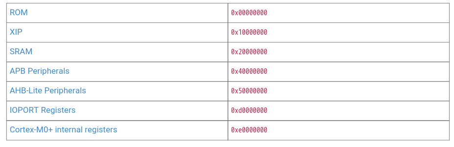

# RP2040 chip memory layout

pembagian nya ada di sini:

# ROM
Kode untuk rom ini immutable (belum dicoba), dimulai dari 0x00000000 sampai sejauh 16 kB (0x00004000)

total sram di chip RP2040 ada 264kB (TOTALNYA saja), tapi perlu diketahu bahwa itu semua aslinya dibagi bagi per-area address nya

jika di docs, sram ini dimulai dari 0x20000000 (summary), tapi secara fisik, dibagi menjadi 6 bank

dimana

word addr 0
- bank 0: 0x20000000
- bank 1: 0x20000004
- bank 2: 0x20000008
- bank 3: 0x2000000c

word addr 1
- bank 0: 0x20000010
- bank 1: 0x20000014
- bank 2: 0x20000018
- bank 3: 0x2000001c

word addr 2
- bank 0: 0x20000020
- bank 1: 0x20000024
- bank 2: 0x20000028
- bank 3: 0x2000002c

dst