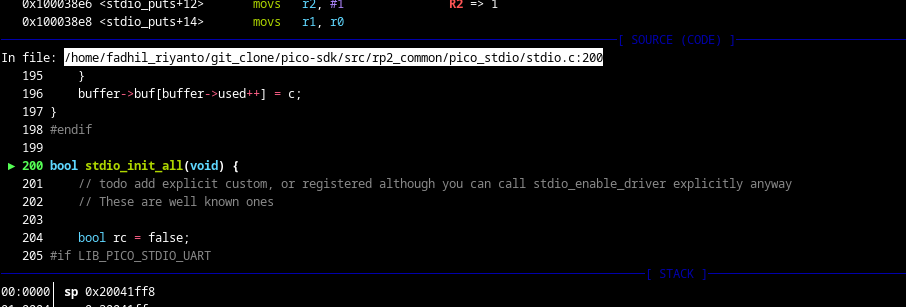

# stdio_init_all() analysis

first, lets debug this with real hardware & openocd

do not forget to add breakpoint in this func

the sequence of execution:

- `/home/fadhil_riyanto/git_clone/pico-sdk/src/rp2_common/pico_stdio/stdio.c:200` -> stdio_init_all()
- `/home/fadhil_riyanto/git_clone/pico-sdk/src/rp2_common/pico_stdio_uart/stdio_uart.c:37` -> stdio_uart_init()
- `/home/fadhil_riyanto/git_clone/pico-sdk/src/rp2_common/pico_stdio_uart/stdio_uart.c:93` -> stdio_uart_init_full()
- `/home/fadhil_riyanto/git_clone/pico-sdk/src/rp2_common/hardware_gpio/gpio.c:38` -> gpio_set_function()
- `/home/fadhil_riyanto/git_clone/pico-sdk/src/rp2_common/hardware_uart/uart.c:42` -> uart_init()

WIP (SOON)