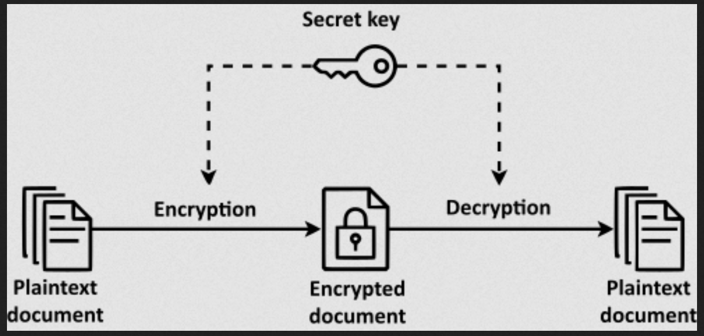

# symmetric block chiper

- [https://en.wikipedia.org/wiki/Symmetric-key_algorithm](https://en.wikipedia.org/wiki/Symmetric-key_algorithm)
in simply terms, symmetric block chiper is a way where encryption and decryption is uses same key. for example

credit: wikipedia.org

CLUE: just like zip file

this is example of symmetric key algorithm

- AES-128
- AES-192
- AES-256
- ARIA-128
- ARIA-192
- ARIA-256
- CAMELLIA-128
- CAMELLIA-192
- CAMELLIA-256
- DES
- DES3

example

# AES
