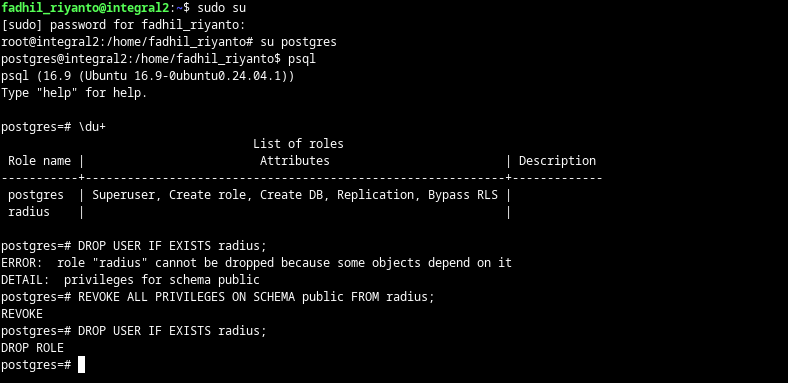

# PostgreSQL database creation flow

in order to create database (for safety, I use postgres account). I use this step.

first, we need to login as `postgres` user, use this `sudo -u postgres psql`, then do

```sql
CREATE DATABASE EXAMPLE_DB;
```

this is optional
```sql
CREATE USER EXAMPLE_USER WITH ENCRYPTED PASSWORD 'Sup3rS3cret';
```

grant
```sql
GRANT ALL PRIVILEGES ON DATABASE EXAMPLE_DB TO EXAMPLE_USER;
```

now, change the state using `\c EXAMPLE_DB postgres`, execute this command
```sql
GRANT ALL ON SCHEMA public TO EXAMPLE_USER;
```

then, change ownership
```sql
ALTER DATABASE my_database OWNER TO my_database_user;
```

notes: [https://stackoverflow.com/questions/67276391/why-am-i-getting-a-permission-denied-error-for-schema-public-on-pgadmin-4](https://stackoverflow.com/questions/67276391/why-am-i-getting-a-permission-denied-error-for-schema-public-on-pgadmin-4)

# reverse
first, we change to postgres account

```sh
su postgres
```

list database: \l

remove: 
```sql
DROP DATABASE abc;
```

drop user, first list users first: `\du+`

drop: 
```sql
DROP USER IF EXISTS foobar;
```

revoking access:
```sql
REVOKE ALL PRIVILEGES ON SCHEMA public FROM foobar;

-- for tables, seq, and func
REVOKE ALL PRIVILEGES ON ALL TABLES IN SCHEMA public FROM foobar;
REVOKE ALL PRIVILEGES ON ALL SEQUENCES IN SCHEMA public FROM foobar;
REVOKE ALL PRIVILEGES ON ALL FUNCTIONS IN SCHEMA public FROM foobar;
```

check object ownership
```sql
SELECT 
    n.nspname AS schema,
    c.relname AS object,
    c.relkind AS type
FROM 
    pg_class c
JOIN 
    pg_roles r ON c.relowner = r.oid
JOIN 
    pg_namespace n ON n.oid = c.relnamespace
WHERE 
    r.rolname = 'foobar';
```

or `\ddp  -- in psql`



## granting
granting all sequences
```sql
GRANT ALL PRIVILEGES ON ALL SEQUENCES IN SCHEMA public TO radius;
```