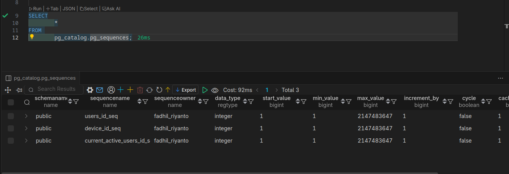

# system table in pgsql (catalog)

### pg_tables | [docs](https://www.postgresql.org/docs/current/view-pg-tables.html)

catalog pgsql yang isinya data ttg table (di db saat ini), contoh query nya

```
SELECT
        *
FROM 
        pg_catalog.pg_tables as x
WHERE
        x.schemaname = 'public';
```

### pg_sequences

yg ini isinya sequence2 semua, mirip kayak serial datatype di pgsql


NOTES: `pg_sequence` adalah versi low levelnya, sedangkan `pg_sequences` adalah versi view dari join-an `pg_sequence` dan `pg_class`, bukti

```sql
SELECT
        *
FROM
        pg_get_viewdef('pg_catalog.pg_sequences', true)
```
hasil
```sql
SELECT 
        n.nspname AS schemaname, 
        c.relname AS sequencename, 
        pg_get_userbyid(c.relowner) AS sequenceowner, 
        s.seqtypid :: regtype AS data_type, 
        s.seqstart AS start_value, 
        s.seqmin AS min_value, 
        s.seqmax AS max_value, 
        s.seqincrement AS increment_by, 
        s.seqcycle AS cycle, 
        s.seqcache AS cache_size, 
        CASE WHEN has_sequence_privilege(c.oid, 'SELECT,USAGE' :: text) THEN pg_sequence_last_value(c.oid :: regclass) ELSE NULL :: bigint END AS last_value 
FROM 
        pg_sequence s 
        JOIN pg_class c ON c.oid = s.seqrelid 
        LEFT JOIN pg_namespace n ON n.oid = c.relnamespace 
WHERE 
        NOT pg_is_other_temp_schema(n.oid) 
        AND c.relkind = 'S' :: "char";

```