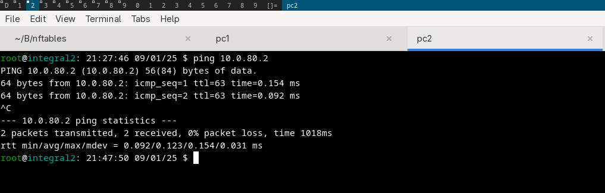
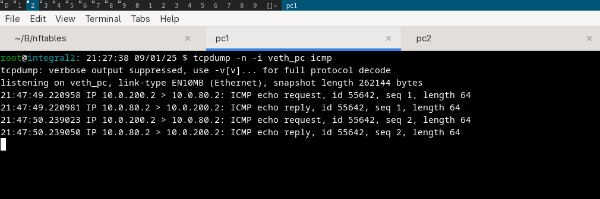

ICMP
====

This is will clearly what happen during PING. and why I write this
first, I have a problem understanding this docs 

particularly at this stuff

.. code-block:: 
        
        icmp type { echo-reply, destination-unreachable, source-quench, 
        redirect, echo-request, time-exceeded, parameter-problem, 
        timestamp-request, timestamp-reply, info-request, info-reply, 
        address-mask-request, address-mask-reply, router-advertisement, 
        router-solicitation }

the url: https://wiki.nftables.org/wiki-nftables/index.php/Quick_reference-nftables_in_10_minutes#Icmp

Reason
-------------

recenly, I created my very-first own firewall configuration, this will be big soon (very likely). I started
with small things, the idea is very simple

block incoming ICMP from other PC, and allow me to ping other, sounds fun right :) 

my nft 

.. code-block::  

        # todo, block incoming from outside wlan0
        # allow already connected connection
        flush ruleset

        table ip ipt_filter {
                chain input {
                        type filter hook input priority 0; policy accept;

                        icmp type echo-request drop;
                }

                chain output {
                        type filter hook output priority 0; policy accept;
                        
                        ip protocol icmp accept
                }
        }

the problem is, idk what is echo-request is, and how I can see what kind of ICMP packet that flow through
my linux network stack 

Proofing what happen
--------------------

Today, let's see what actually flowing right now, I'm on special environment (see :doc:`nftables-lab-setup`)

test 1
^^^^^^

test 2
^^^^^^

