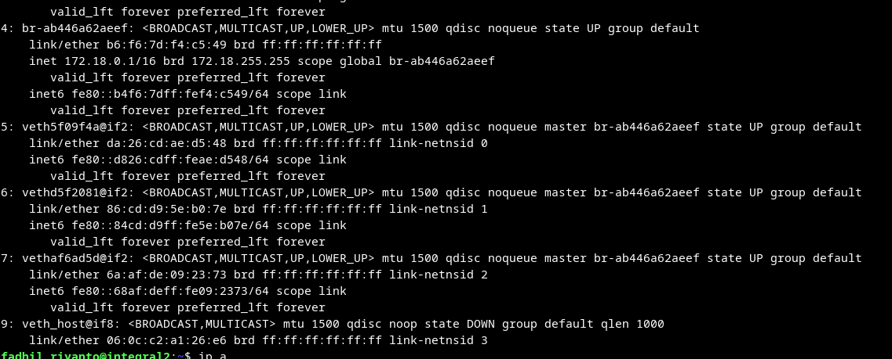
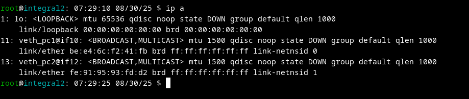
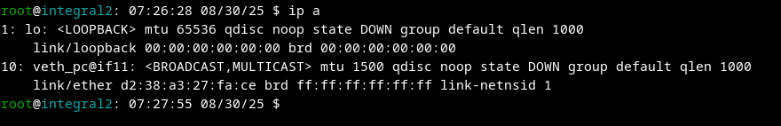
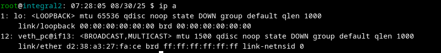

.. _nftables_lab_setup:

=====================
nftables Lab Setup
=====================

This document describes how to set up a lab environment for testing nftables configurations and learning nftables.

First Setup: netns
------------------

Create a network namespace:

.. code-block:: shell

        sudo unshare -r --net bash
        ip a
        echo $$

Save the PID number from ``echo $$``.

On Host Network
---------------

.. code-block:: shell

        ip link add veth_host type veth peer name veth_guest && \
        ip link set veth_guest netns <PID>

The ``veth_guest`` interface is moved to the secondary terminal.

Adding an IP
------------

On host:

.. code-block:: shell

        sudo ip link add br0 type bridge && \
        sudo ip link set veth_host master br0 && \
        sudo ip link set veth_host up && \
        sudo ip addr add 10.0.0.1/24 dev br0 && \
        sudo ip link set br0 up

On guest:

.. code-block:: shell

        ip addr add 10.0.0.2/24 dev veth_guest && \
        ip link set veth_guest up

Lab Setup: Version 2
--------------------

Create three network namespaces: two PCs and one router.

Setup Terminal & netns
~~~~~~~~~~~~~~~~~~~~~~

Run in three different terminals:

.. code-block:: shell

        unshare -r --net bash
        echo $$

Remember each PID!

Create the Interface
~~~~~~~~~~~~~~~~~~~~

Run on the host (replace PIDs as needed):

.. code-block:: shell

        sudo ip link add veth_pc1 type veth peer name veth_pc
        sudo ip link set veth_pc netns <PC1_PID>
        sudo ip link set veth_pc1 netns <ROUTER_PID>

        sudo ip link add veth_pc2 type veth peer name veth_pc
        sudo ip link set veth_pc netns <PC2_PID>
        sudo ip link set veth_pc2 netns <ROUTER_PID>

Result:

Router:

PC 1:

PC 2:

Assign IP Addresses
~~~~~~~~~~~~~~~~~~~

Scheme:

- **PC1**
         - Network: ``10.0.80.0/24``
         - ``veth_pc@if11``: ``10.0.80.2/24``
- **PC2**
         - Network: ``10.0.200.0/24``
         - ``veth_pc@if13``: ``10.0.200.2/24``
- **Router**
         - ``veth_pc1@if10``: ``10.0.80.1/24``
         - ``veth_pc2@if12``: ``10.0.200.1/24``

Commands:

.. code-block:: shell

        # on pc 1
        ip addr add 10.0.80.2/24 dev veth_pc
        ip link set veth_pc up
        ip route add default via 10.0.80.1

        # on pc 2
        ip addr add 10.0.200.2/24 dev veth_pc
        ip link set veth_pc up
        ip route add default via 10.0.200.1

        # on router
        ip addr add 10.0.80.1/24 dev veth_pc1
        ip addr add 10.0.200.1/24 dev veth_pc2
        ip link set veth_pc1 up
        ip link set veth_pc2 up
        sysctl -w net.ipv4.ip_forward=1

Linux automatically creates routes:

.. code-block:: shell

        ip r
        10.0.80.0/24 dev veth_pc1 proto kernel scope link src 10.0.80.1 
        10.0.200.0/24 dev veth_pc2 proto kernel scope link src 10.0.200.1 

Note: For a simpler setup, see: https://gist.github.com/fadhil-riyanto/1db84f4cf3f79b5ea8e2f04c2b540183

QEMU
----

To run this lab setup in QEMU, use the following command. Teletype terminal is used to prevent disconnection when using SSH.

.. code-block:: shell

        qemu-system-x86_64 -name guest=ubuntu22.04 \
                 -machine type=pc,accel=kvm \
                 -cpu host -m 4G -smp 4 \
                 -enable-kvm \
                 -boot order=d \
                 -drive if=pflash,format=raw,readonly=on,file=/usr/share/edk2/x64/OVMF_CODE.4m.fd \
                 -drive if=pflash,format=raw,file=./nvram/OVMF_VARS_ubuntu_server_gpt.4m.fd \
                 -drive file=./images/ubuntu-server-btik-captive-portal.img,format=qcow2 \
                 -netdev user,id=net0,hostfwd=tcp::20022-:22,hostfwd=tcp::10000-:5432,hostfwd=tcp::10302-:10302,hostfwd=tcp::8080-:8080,hostfwd=udp::1813-:1813,hostfwd=udp::1812-:1812 \
                 -device virtio-net-pci,netdev=net0 \
                 -nographic \
                 -serial mon:stdio \
                 -device virtio-serial \
                 -chardev pty,id=char0 \
                 -device virtconsole,chardev=char0 \
                 -chardev pty,id=char1 \
                 -device virtconsole,chardev=char1
