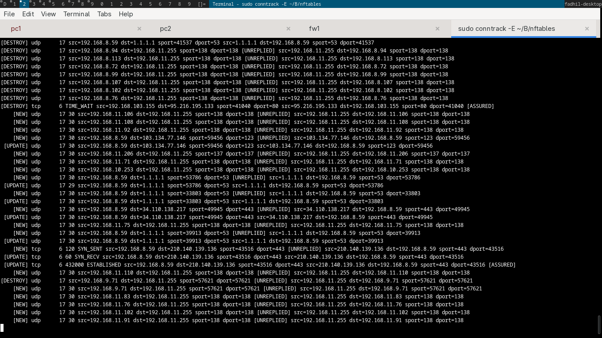
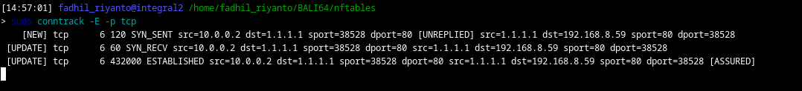

See the connection track (conntrack)
====================================

today, I doing intresting stuff. I setup veth with configuration like this

pc1: 10.0.80.2 (10.0.80.0/24)
pc2: 10.0.200.2 (10.0.200.0/24)

and the router, that has 3 interface
veth_pc1: 10.0.80.1
veth_pc2: 10.0.200.1
veth_router: 10.0.0.2

and, the veth_router is connected to my machine via 10.0.0.1, here iptables

.. code-block:: bash

        sudo iptables -A FORWARD -i veth_host -o enp2s0 -j ACCEPT
        sudo iptables -A FORWARD -i enp2s0 -o veth_host -m state --state ESTABLISHED,RELATED -j ACCEPT
        iptables -t nat -A POSTROUTING -s 10.0.0.0/24 -o enp2s0 -j MASQUERADE
        sudo sysctl -w net.ipv4.ip_forward=1

and, here the conntrack

run ``sudo conntrack -E``

example 1
---------

lets open a dummy connection to 1.1.1.1

then watch the conntrack

