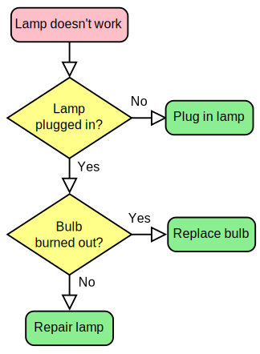

# Resume alpro

## flowchart
Apa itu flowchart? simplenya, flowchat itu semacam bentuk gambar atau visual dari suatu langkah langkah algoritma. dan tentunya karna ini algoritma, maka ada step step seperti jika x maka y, lalu panah panah dari atas ke bawah, lalu input, dll. contoh flowchart cara memperbiaki lampu



## Class
    Apa itu class? class adalah cara kita mengatur kode agar scope nya bisa dipecah, misal func a isinya ada 1000 line, nah agar mudah mendebugnya, kita bisa pecah ke method method yang sangat banyak, dan juga kita tidak perlu lagi pusing dengan banyak variabel, kita cukup memakai satu varlable, lalu gunakan di seluruh class yang dinamai "property"

    contoh simple, pakai property untuk nyimpan-tampilkan data,

```cpp
#include <string>
#include <iostream>

using namespace std;

class abc {
    string nama;
public:
    void set_nama(string nama) {
        this->nama = nama;
    }

    void get_nama() {
        cout << this->nama << endl;
    }
};

int main() {
    abc abc;
    abc.set_nama("fadhil");
    abc.get_nama();
}
```

## Enkapsulasi (encapsulation)
Trik atau cara agar kita bisa memberi aturan ke class/property apakah ia bisa terlihat (public)? atau tidak (private/protected) ke class.

Intinya, bagaimana cara kita agar method atau property, tidak bisa secara sembarang diakses oleh kode lain. misal kita ada class trigonometri, dan method hitung sin, tetapi didalam hitung sin tersebut, ada method kecil kecil lagi yang banyak, tetapi fungsinya seperti hanya untuk ngebantu fungsi sin menjalankan tugasnya, nah fungsi2 yang kecil tadi itu nanti dibuat private, sedangkan fungsi sin yg dipakai dimana mana, dibuat public.

contoh kecil

```cpp
#include <string>
#include <iostream>

using namespace std;

class abc {
    string nama;
private:
    void print_perkenalan() {
        cout << "perkenalkan nama saya ";
    }

public:
    void set_nama(string nama) {
        this->nama = nama;
    }

    void get_nama() {
        this->print_perkenalan();
        cout << this->nama << endl;
    }
};

int main() {
    abc abc;
    abc.set_nama("fadhil");
    abc.get_nama();
}
```

terlihat public, private? nah itu adalah contoh encapsulation.

nah, `print_perkenalan` (hanya contoh) bertindak seolah olah dia hanya internal function dari suatu class yg besar. dan yang dipanggil dimana mana adalah get nama, dimana dibaliknya dia manggil banyak func yang lain.

dan `print_perkenalan` tidak boleh diakses langsung. termasuk property `nama` juga tidak boleh diakses langsung

## Sorting
### Bubble Sort
Konsepnya, dengan cara melempar lempar data array, sampai dia urut, BigO nya `O(n^2)`. cara kerja nya yaitu dengan cara menukar-nukar posisi array sekarang dengan array didepannya, jika array saat ini > dari array didepannya, maka tukar posisinya

misal ada data simple seperti ini

```
2  3  1  (awal mulanya)
2  1  3  (3 ditukar karna 3 > 1)
1  2  3 (2 ditukar karna 2 > 1)
1  2  3  (selesai)
```

### Selection Sort

TL;DR, menemukan data yg lebih kecil dari nilai minimum saat ini, tunggu loopnya yang didalam selesai baru di swap.
```
contoh kita akan sorting

2  9  4   1  (belum diapa-apakan)
2  9  4   1  (minimum index ke 0, yaitu 2)
2  9  4   1  (bandingkan 9 dgn index ke 0 yaitu 2, 9 < 2 false)
2  9  4   1  (bandingkan 4 dgn index ke 0, yaitu 2, 4 < 2, false)
2  9  4   1  (bandingkan 1 dgn index ke 0, yaitu 2, 1 < 2, true, maka tukar)
1  9  4   2  (set minimum di index  ke 1 sekarang, yaitu 9)
1  9  4   2  (bandingkan 4 dgn index ke 1, 4 < 9, true, maka kita biarkan karna loop belum selesai, tapi set minimum ke 4)
1  9  4   2  (cek apakah 2 < 4, ya, set minimum ke 2)
1  2  4   9  (tukar)
1  2  4   9  (set minimum ke index ke 3, yaitu 4, apakah 9 < 4, tidak)
--end---
```

### insertion sort
Konsepnya, misal lagi menyusun kartu dari satu per satu. Jadi kamu ambil satu kartu, terus kamu bandingin ke kiri, kalau dia lebih kecil dari yang di kiri-nya, tukar posisinya. Terus begitu sampai semua kartu (data) urut

contoh
```
5 3 4 1 (unchanged)
3 5 4 1 (3 dimasukkan ke kiri 5 karena 3 < 5)
3 4 5 1 (4 dimasukkan, dia lebih kecil dari 5, jadi tukar)
1 3 4 5 (1 dimasukkan paling kiri, karena dia lebih kecil dari semuanya)
```


### merge sort
misal ada data, terus di bagi-bagi tumpukan data jadi kecil-kecil dulu sampai tinggal satuan, baru nanti disusun lagi sambil dibandingin dan digabungin pelan-pelan sampai jadi urut.
Cara kerjanya pakai prinsip divide and conquer
Jadi data dibelah-belah jadi dua terus, sampai tinggal 1-an, lalu disatukan lagi sambil diurutin.

contoh gifnya (google)


### sequential search
nah, ini search paling gampang wkwkwk, intinya loop terus array nya, jika ketemu idx nya pakai if else, maka break loopnya & end

### binary searching
cara mencarinya data dibagi 2 ditengah tengah, lalu setelah dibagi 2, akan ada low (pojok kiri), mid (tengah tengah), high (pojok kanan). lalu cek saja pastikan data yg dicari == mid

jika tidak, maka cek statusnya dia kurang dari mid atau lebih, jika lebih, cari bagian kanan, jika kurang, cari bagian kiri. proses ini diulang terus dan tiap2 menemukan low dan high baru, maka mid pasti berubah.

### single linked list
misal, ini PSEUDOCODE

```
struct node {
    data_asli,
    pointer_ke_struct_node_lain_sebut_saja_n
}
```

misal, kita define struct node sebagai a, maka kita ambil addr nya, lalu define lagi b, dimana b berisi data dan juga pointer ke a, lalu misal define lagi c, isinya pointer ke b.

maka secara harfiah, c -> b -> a 
nah, untuk pengecekan, loop lalu deference terus saja untuk pointernya, jadi yg awalnya di c, setelah deference pointer milik b, posisi sekarang di b, lalu deference pointer next nya, alhasil kita dapat a, dan agar bisa stop. maka bagian palig akhir harus dikasih tanda, contoh disini tandanya bisa pakai nullptr.

intinya jika pas di deference isinya nullptr, maka sudah selesai

## sinle linked list circular
sama saja seperti single linked list, hanya aja dibagian akhir daripada diisi nullptr, kita isi pointer balik ke awal. alhasil dia seperti memutar.