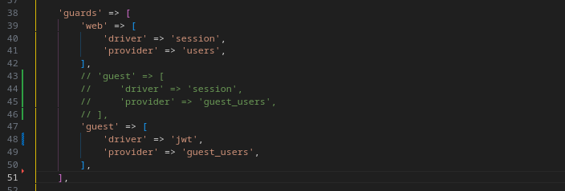
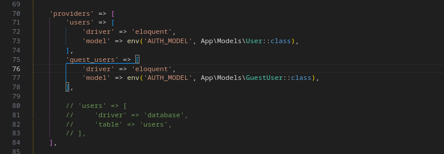
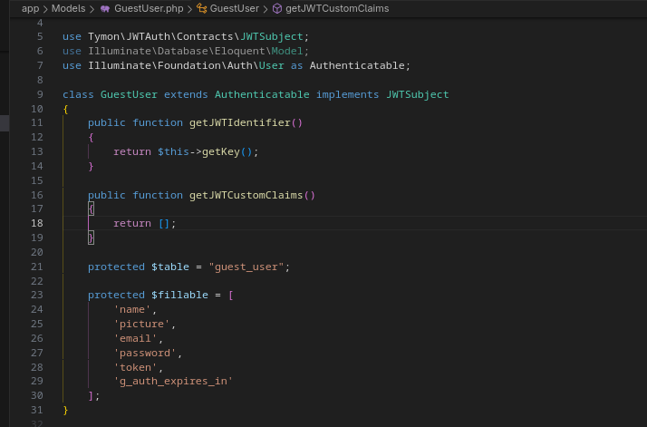

# installing tymon/jwt-auth with custom guard

now, we will install this package as is with custom guard. so we do not use `web` guard.

# installing

read [https://jwt-auth.readthedocs.io/en/develop/laravel-installation/](https://jwt-auth.readthedocs.io/en/develop/laravel-installation/) please

do the step until reached `php artisan jwt:secret`, skip lumen Installation please

# quickstart 
please read [php/custom_auth_guard_w_tables.md](/php/custom_auth_guard_w_tables.md) first, then replace this

```php
'guest' => [
    'driver' => 'jwt',
    'provider' => 'guest_users',
],
```

in your `./config/auth.php` file, just like this



then, make sure your custom guard class is implement `Tymon\JWTAuth\Contracts\JWTSubject`, you can see the location of models class

example, in `./config/auth.php`



just make it like this



# middleware & routing config

this section you only need to do 

```php
Route::get('/callback', [Controllers\Guest\GoogleAuthController::class, 'callback'])
            ->name("auth.google.callback")
            ->middleware("guest");
```

change with your own routing

# PoC
FIRST, we use `callback` method, so the inside of `callback` method body should look like this

```php
packed_arr = [
    "email" => $email,
    "password" => "password"
];

$token = Auth::guard("guest")->attempt($packed_arr);

if ($token) {
    return  $this->respondWithToken($token);
} else {
    return response()->json(['error' => 'Invalid credentials'], 401);
}
```

`respondWithToken` method

```php
protected function respondWithToken($token)
    {
        return response()->json([
            'access_token' => $token,
            'token_type' => 'bearer',
            'expires_in' => Auth::guard("guest")->factory()->getTTL() * 60
        ]);
    }
```