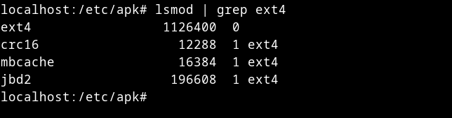
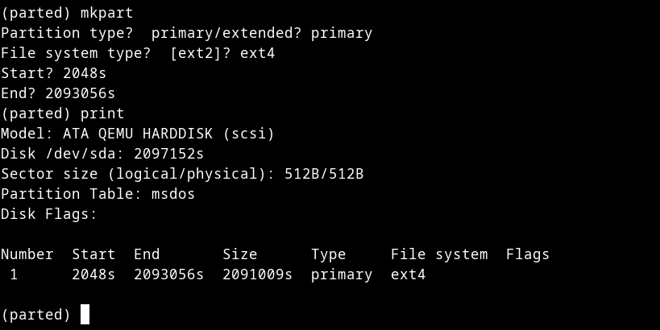

# Alpine htop install on live QEMU

# create disk first
```sh
qemu-img create -f qcow2 alpine-1.qcow2 1G
```

# start qemu

download iso here [https://dl-cdn.alpinelinux.org/alpine/v3.21/releases/x86_64/alpine-virt-3.21.3-x86_64.iso](https://dl-cdn.alpinelinux.org/alpine/v3.21/releases/x86_64/alpine-virt-3.21.3-x86_64.iso)

```sh
qemu-system-x86_64 \
      -enable-kvm \
      -m 256 \
      -smp 4 \
      -cpu host \
      -drive file=pc-1.qcow2,format=qcow2 \
      -cdrom alpine-virt-3.21.3-x86_64.iso \
      -boot d \
      -net nic \
      -net user -nographic
```

default username is `root`, password left blank, just enter

# set eth0 up & DHCP
- `ip link set dev eth0 up`
- `udhcpc -i eth0`
- `ping 1.1.1.1` (testing)

for `/etc/resolv.conf`, change to `nameserver 1.1.1.1`

# patch apk configuration
`cp /etc/apk/repositories /etc/apk/repositories-old`

```
--- repositories-old
+++ repositories
@@ -1 +1,2 @@
-/media/cdrom/apks
+http://dl-cdn.alpinelinux.org/alpine/v3.21/main
+http://dl-cdn.alpinelinux.org/alpine/v3.21/community
```

# update
- `apk update`
- `apk cache download`
- `apk cache -v sync`


# setup partition

<div class="warning">
Note 

set it with your needs, I use entire disk in this docs
</div>

make sure first your ext4 kernel module is installed & loaded by typing

- `lsmod | grep ext4`: check
- `modprobe ext4`
- `lsmod | grep ext4`: recheck again

the output is should be something like this


then we can move forward to ext4 partition generation

# partitioning
install parted first using `apk add parted`, check your disk first using `fdisk -l`, for example there is `/dev/sda`

## parted section
run `parted /dev/sda`, inside of parted is

- `unit s`
- `mklabel [gpt/msdos]`: I use msdos anyway
- `print`: identify disk size by see on section something like Disk /dev/sda: 2097152s, there has 2097152s sector, so I use 2097152 - (2948 * 2), which is 2093056s
- `mkpart`
	- `primary`
	- `ext4`
	- `2048s`
	- `2093056s`
      - `q`

resulted partition:


# setup diskless install
warn: you need to enable ext4 kernel module or you'll get `mount: mounting /dev/sda1 on /media/sda1 failed: Invalid argument` when mounting

- `modprobe ext4`
- `apk add e2fsprogs` for `mkfs.ext4` command
- `mkfs.ext4 /dev/sda1`
- `mount /dev/sda1 /media/sda1`: mount location should be located on `/media`, not `/mnt`

then, you can do normal `setup-alpine`, except for this thing

- Which disk(s) would you like to use? (or '?' for help or 'none') [none] none
- Enter where to store configs ('floppy', 'sda1', 'usb' or 'none') [sda1] sda1
- Enter apk cache directory (or '?' or 'none') [/media/sda1/cache] /media/sda1/cache

# LBU
run `lbu commit`