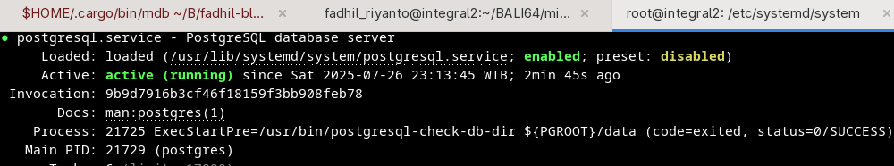

# change default postgresql data dir

- first, you need root account
- identify your service file. by running `systemctl status postgresql`

in my case, `/usr/lib/systemd/system/postgresql.service` is the service file

- editing
	- `mkdir /home/postgres`
	- `chown -R postgres:postgres /home/postgres`
	- edit `Environment=PGROOT=/home/postgres` and `ProtectHome=false`
	- run `systemctl daemon-reload && sudo systemctl restart postgresql && sudo systemctl status postgresql`

	