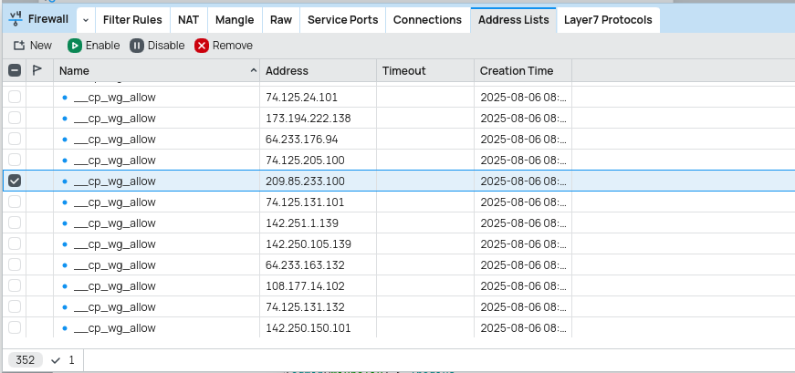
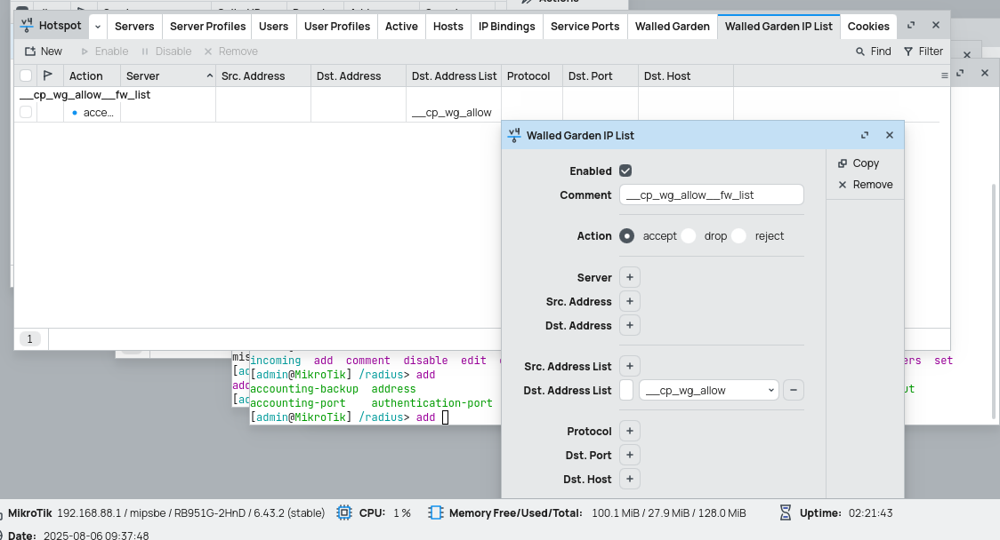

# Huge IP addr in firewall mikrotik

this is the technique to add huge ip addr into firewall without making it 100% cpu usage

lets create address list





# doing this with routeros_api python

removing

```python
list_queues = api.get_resource('/ip/firewall/address-list');
prev_ips = list_queues.get(list='__cp_wg_allow')

# print(prev_ips)
for prev_ips_i in prev_ips:
    print(f"[removing] {prev_ips_i['address']}")
    list_queues.remove(id=prev_ips_i['id'])

```

adding

```python
for x in data:
print(f"[adding] {x}")
api.get_resource("/ip/firewall/address-list").call("add", 
                    {"list": "__cp_wg_allow", "address": x},
).done_message
```

add to walled garden
```python
print("installing walled garden ip lists")
api.get_resource("/ip/hotspot/walled-garden/ip").call("add", {
    "comment": "__cp_wg_allow__fw_list",
    "dst-address-list": "__cp_wg_allow",
},).done_message
```