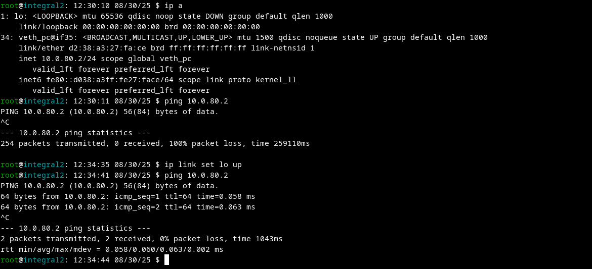
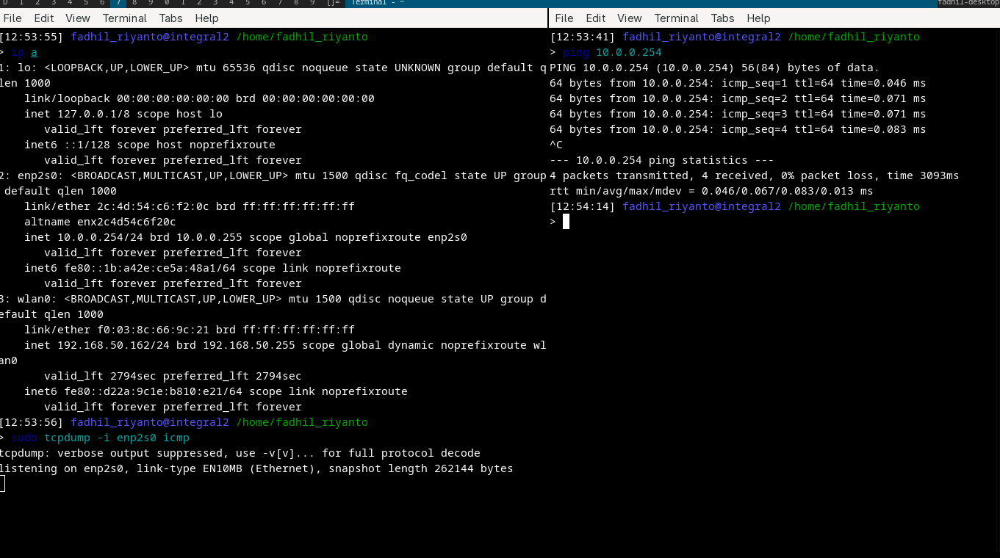
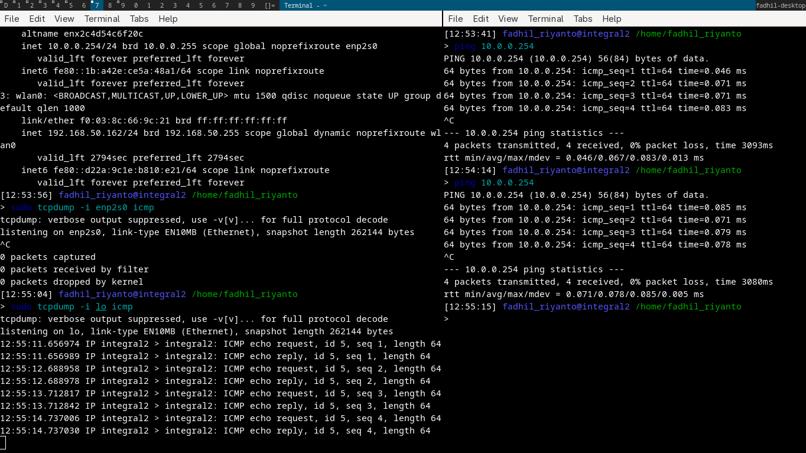

# proof of Self-Ping ip in Linux

## proof 1
this clearly say that `lo` interface is down, and I try to ping my own IP. but failed. after turn on `lo` interface, the ping get normal

## proof 2

clearly that TCPDUMP didnt record anything on `enp2s0` interface

meanwhile

proof, that packet for x ip, where the x is our own machine IP, is not routed through NIC, it just pass over `lo` interface even there has no correlation about 127.0.0.1 and 10.0.0.254, the packet still reach `lo`