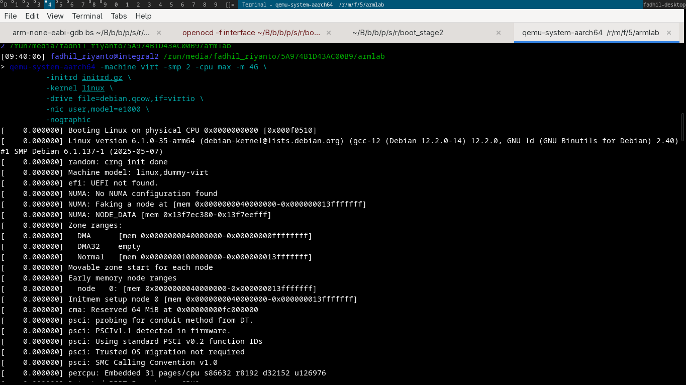
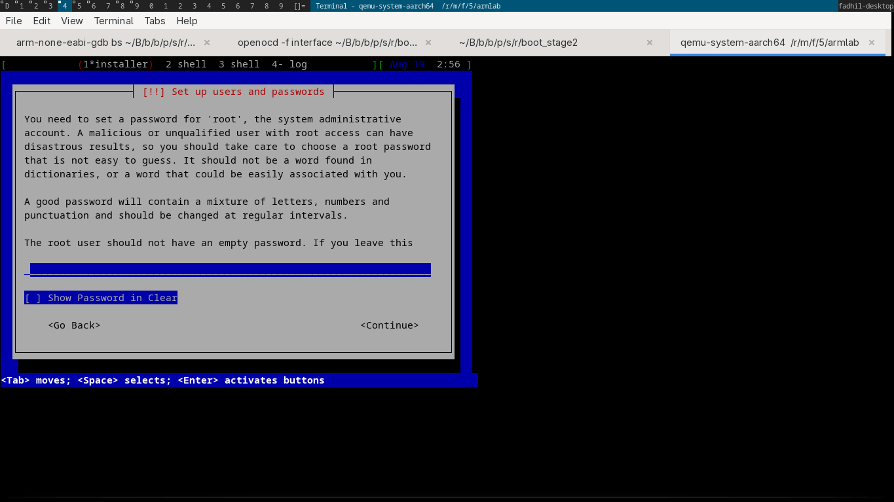

# qemu booting debian ARM64

this tutorial based on [https://blog.jitendrapatro.me/emulating-aarch64arm64-with-qemu-part-1/](https://blog.jitendrapatro.me/emulating-aarch64arm64-with-qemu-part-1/), big thanks!

I will replicate the steps

### create qcow2
```sh
qemu-img create -f qcow2 debian.qcow 16G
```

after it, in future in case the url is 404, please look at [this](http://ftp.debian.org/debian/dists/bookworm/main/installer-arm64/current/images/netboot/debian-installer/arm64/)

### download the init & kernel

```sh
wget http://ftp.debian.org/debian/dists/bookworm/main/installer-arm64/current/images/netboot/debian-installer/arm64/initrd.gz
wget http://ftp.debian.org/debian/dists/bookworm/main/installer-arm64/current/images/netboot/debian-installer/arm64/linux
```

### run the system
```sh
qemu-system-aarch64 -machine virt -smp 2 -cpu max -m 4G \
          -initrd initrd.gz \
          -kernel linux \
          -drive file=debian.qcow,if=virtio \
          -nic user,model=e1000
```

### ss

