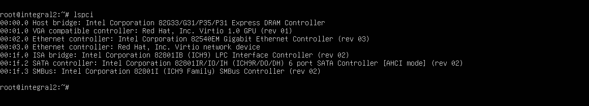
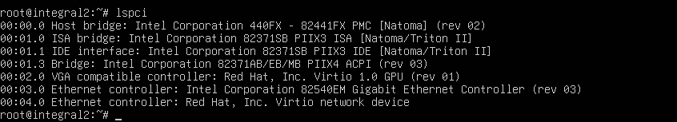

# qemu q35 vs i440fx

# q35
this is lspci output from ubuntu server

# i440fx

 http://wiki.qemu.org/images/4/4e/Q35.pdf

http://wiki.qemu.org/images/f/f6/PCIvsPCIe.pdf

http://git.qemu.org/?p=qemu.git;a=blob;f=docs/pcie.txt 