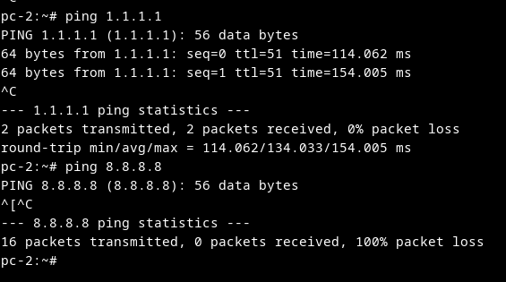

# QEMU block 8.8.8.8 from host

after [this](../server/qemu_nat.md)

I want this rule

- allow other ICMP (i.e 1.1.1.1)
- deny ICMP 8.8.8.8

# iptables rule

suppose, vm ip is 192.168.12.2, so the iptables command is
```sh
sudo iptables -t filter -A FORWARD -s 192.168.12.2 -d 8.8.8.8 -p icmp -j DROP
```
note: 
 
- t: explicit table
- a: table FORWARD
- s: source from 192.168.12.2 (OUR VM)
- d: destination: 8.8.8.8
- p: protocol (which is ICMP)
- j: jump 

# the problem

you may see ping 8.8.8.8 still success, let check iptables rule
```sh
sudo iptables -t filter -L FORWARD -n --line-numbers -v
```

the output

```
Chain FORWARD (policy ACCEPT)
num  target     prot opt source               destination         
1    ACCEPT     all  --  0.0.0.0/0            0.0.0.0/0            state RELATED,ESTABLISHED
2    ACCEPT     all  --  0.0.0.0/0            0.0.0.0/0           
3    DROP       icmp --  192.168.12.2         8.8.8.8             
```

see? when ping to 8.8.8.8, its stop at rule 2, which abort 3st rule, in order to fix it, we need re-order this

remote all rule
```sh
sudo iptables -t filter -F FORWARD
```

re-add

```sh
sudo iptables -t filter -A FORWARD -m state --state RELATED,ESTABLISHED -j ACCEPT
sudo iptables -t filter -A FORWARD -s 192.168.12.2 -d 8.8.8.8 -p icmp -j DROP
sudo iptables -t filter -A FORWARD -s 192.168.12.2/24 -j ACCEPT
```

Try re-run `sudo iptables -t filter -L FORWARD -n --line-numbers`

the order should be fixed

```
Chain FORWARD (policy ACCEPT)
num  target     prot opt source               destination         
1               all  --  0.0.0.0/0            0.0.0.0/0            state RELATED,ESTABLISHED
2    DROP       icmp --  192.168.12.2         8.8.8.8             
3    ACCEPT     all  --  0.0.0.0/0            0.0.0.0/0           
```

