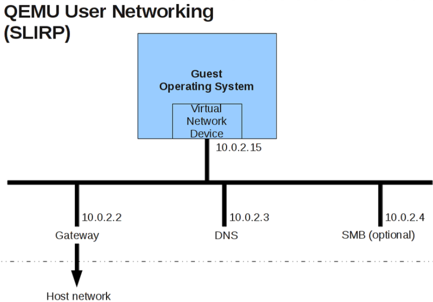

# qemu default network

The default gateway in QEMU when using the default user-mode networking (SLIRP) is typically 10.0.2.2 on the network 10.0.2.0/24. QEMU creates a virtual NAT network where the guest is assigned an IP like 10.0.2.15 by DHCP, and the gateway for the guest to reach outside networks is 10.0.2.2. This gateway is implemented inside QEMU and handles routing and NAT for the guest's traffic.

- Default network: 10.0.2.0/24
- Default gateway: 10.0.2.2
- Default guest IP (DHCP assigned): 10.0.2.15
- Default DNS server in guest: 10.0.2.3

This setup requires no special host configuration or root privileges and is the default networking mode for QEMU user mode networking.

additional
- [https://docs.zephyrproject.org/latest/connectivity/networking/qemu_user_setup.html](https://docs.zephyrproject.org/latest/connectivity/networking/qemu_user_setup.html)
- [https://darnassus.sceen.net/~hurd-web/hurd/running/qemu/networking/](https://darnassus.sceen.net/~hurd-web/hurd/running/qemu/networking/)
- [https://wiki.qemu.org/Documentation/Networking](https://wiki.qemu.org/Documentation/Networking)

