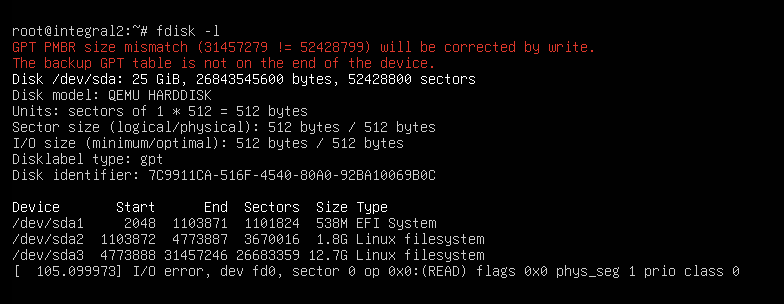
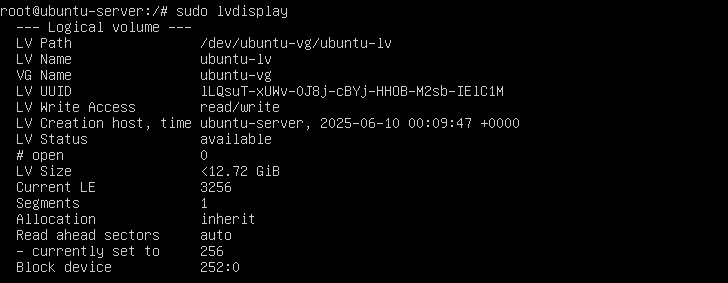

# resizing qemu image

lets add 10 GiB

```sh
qemu-img resize ubuntu-server.img +10G
```

then



nice work!

# fixing
if your ubuntu use LVM2, Use this command



then, run

```sh
sudo lvextend -l +100%FREE /dev/ubuntu-vg/ubuntu-lv
sudo e2fsck -f /dev/ubuntu-vg/ubuntu-lv
sudo resize2fs /dev/ubuntu-vg/ubuntu-lv
```