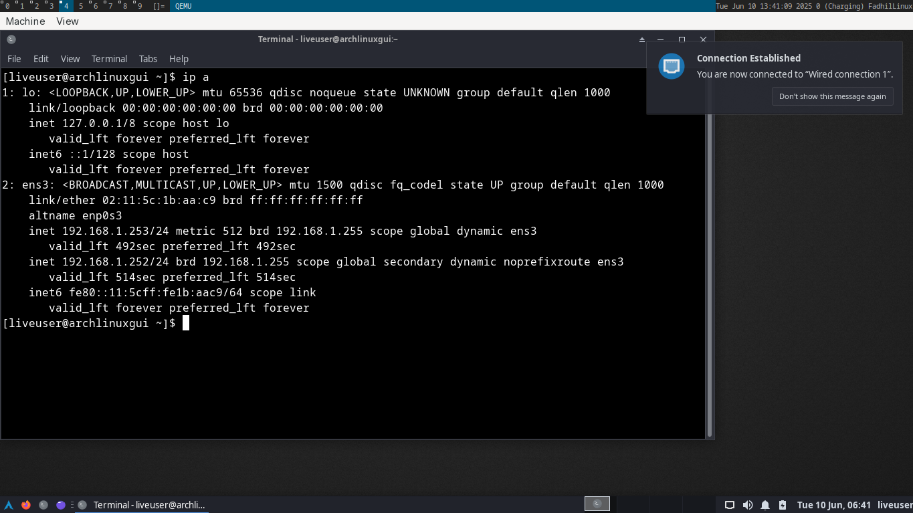

# setting up routeros + ubuntu server (freeradius) + and archlinux client

## first, setup virtual lan
setup configurasi ip hingga seperti ini

```sh
51: br0-lan: <NO-CARRIER,BROADCAST,MULTICAST,UP> mtu 1500 qdisc noqueue state DOWN group default qlen 1000
    link/ether 8a:b9:27:b3:c7:a5 brd ff:ff:ff:ff:ff:ff
    inet6 fe80::88b9:27ff:feb3:c7a5/64 scope link proto kernel_ll 
       valid_lft forever preferred_lft forever
53: tap0: <NO-CARRIER,BROADCAST,MULTICAST,UP> mtu 1500 qdisc fq_codel master br0-lan state DOWN group default qlen 1000
    link/ether c6:33:f3:fe:d3:ba brd ff:ff:ff:ff:ff:ff
    inet6 fe80::c433:f3ff:fefe:d3ba/64 scope link proto kernel_ll 
       valid_lft forever preferred_lft forever
54: tap1: <NO-CARRIER,BROADCAST,MULTICAST,UP> mtu 1500 qdisc fq_codel master br0-lan state DOWN group default qlen 1000
    link/ether a2:eb:ee:56:8a:90 brd ff:ff:ff:ff:ff:ff
    inet6 fe80::a0eb:eeff:fe56:8a90/64 scope link proto kernel_ll 
       valid_lft forever preferred_lft forever
55: tap2: <BROADCAST,MULTICAST> mtu 1500 qdisc noop master br0-lan state DOWN group default qlen 1000
    link/ether c6:c7:1c:7c:67:8a brd ff:ff:ff:ff:ff:ff
```

untuk membuatnya, jalankan skrip command command ini:
- `sudo ip link add br0-lan type bridge` <- buat switch virtual
- `sudo ip tuntap add tap0 mode tap` <- buat colokan virtual
- `sudo ip tuntap add tap1 mode tap`
- `sudo ip tuntap add tap2 mode tap`
- `sudo ip link set tap0 master br0-lan` <- set semua colokan punya induk ke switch br0-lan, intinya harus satu switch
- `sudo ip link set tap1 master br0-lan`
- `sudo ip link set tap2 master br0-lan`
- `sudo ip link set br0-lan up` <- nyalakan semua interface nya
- `sudo ip link set tap0 up`
- `sudo ip link set tap1 up`
- `sudo ip link set tap2 up`

## alokasi interface
- `br0-lan` --> switch utama
- `tap0` --> interface untuk routerOS
- `tap1` --> interface untuk freeradius (running di ubuntu server)
- `tap2` --> interface test client (bisa alpineLinux, archlinux, bebas)

## run routeros

download links: https://download.mikrotik.com/routeros/6.49.18/chr-6.49.18.img.zip

```sh
# convert first
qemu-img convert -f raw -O qcow2 chr-6.49.18.img chr.qcow2

# then run
qemu-system-x86_64 \
      -enable-kvm \
      -smp 4 \
      -m 256M \
      -drive file=chr.qcow2,format=qcow2 \
      -boot order=d \
      -net user,hostfwd=tcp::8291-:8291 \
      -net nic \
      -nographic \
      -netdev tap,id=net0,ifname=tap0,script=no,downscript=no \
      -device virtio-net-pci,netdev=net0,mac=02:11:2a:3b:ff:c3
```


setidaknya, mac-addr nya sama. yaitu ether3

## run ubuntu server

command ini hanya dirun run sekali (ketika instalasi)

```sh
# copy firmware uefi vars
cp /usr/share/edk2/x64/OVMF_VARS.4m.fd .
mv OVMF_VARS.4m.fd OVMF_VARS_ubuntu_server_gpt.4m.fd

# run qemu
qemu-system-x86_64 \
    -enable-kvm \
    -boot order=d \
    -cdrom ubuntu-24.04.2-live-server-amd64.iso \
    -drive if=pflash,format=raw,readonly=on,file=/usr/share/edk2/x64/OVMF_CODE.4m.fd \
    -drive if=pflash,format=raw,file=OVMF_VARS_ubuntu_server_gpt.4m.fd \
    -drive file=ubuntu-server.img,format=qcow2 \
    -m 4G \
    -smp 4 \
    -net user,hostfwd=tcp::20022-:22 \
    -net nic
```

proses instalasi ubuntu server cari di internet xixi.

setelah installed, kita install beberapa base package dahulu. base package yg akan diinstall adalah 

```sh
sudo apt-get update && \
sudo apt-get upgrade && \
sudo apt-get install \
    openssh-server freeradius isc-dhcp-client
```

lalu setelah installed, kita tidak butuh iso lagi, kita bisa buang saja parameter `-cdrom ubuntu-24.04.2-live-server-amd64.iso` karna unused. dan untuk konfigurasi tambahan, saya buat pakai vga virtio (agar text nya smooth), dan juga netdev untuk colokan `tap1` yang nyambung ke bridge

```sh
qemu-system-x86_64 \
    -enable-kvm \
    -boot order=d \
    -drive if=pflash,format=raw,readonly=on,file=/usr/share/edk2/x64/OVMF_CODE.4m.fd \
    -drive if=pflash,format=raw,file=OVMF_VARS_ubuntu_server_gpt.4m.fd \
    -drive file=ubuntu-server.img,format=qcow2 \
    -m 4G \
    -smp 4 \
    -netdev user,id=net0,hostfwd=tcp::20022-:22 \
    -device e1000,netdev=net0 \
    -netdev tap,id=net1,ifname=tap1,script=no,downscript=no \
    -device virtio-net-pci,netdev=net1,mac=02:11:2a:3b:aa:c4 \
    -vga virtio
```

nb: jangan lupa `sudo apt-get update && sudo apt-get upgrade && sudo apt-get install openssh-server`, karna di vm tidak bisa copy paste (mau dari dalam ataupun keluar), dan juga tidak bisa scroll atas bawah. maka proses me-config nya akan pakai ssh saja


intinya biarkan vm nya jalan begitu saja, bisa di minimize atau dipindah ke tab lain yang tidak menganggu. selanjutnya remote vm nya pakai

```sh
ssh -o StrictHostKeyChecking=no -o UserKnownHostsFile=/dev/null  fadhil_riyanto@127.0.0.1 -p 20022
```

nb: ganti `fadhil_riyanto` dengan username yang sudah diset tadi


setidaknya seperti itu remote-an nya

## freeradius
jalankan `sudo apt-get install freeradius`, lalu test dengan `sudo freeradius -X`


pastikan ada tulisan ready to process request

## winbox
karna winbox pakai port 8291 untuk merepote mikrotik, maka kita konek dengan host 127.0.0.1:8291, password sesuai config awal mikrotik ketika awal tadi

winbox localhost


### setup mikrotik dhcp server 
ip -> address


ip -> dhcp server


dns server kita biarkan dahulu


pembuktian: 
jalankan `sudo dhclient enp4` (karna interface tun1 dia dibaca sebagai enp4 di ubuntu server)


ping ke router


router ke ubuntu server 


## setting up Archlinux (GUI)
download dahulu bahan nya di [https://sourceforge.net/projects/arch-linux-gui/](https://sourceforge.net/projects/arch-linux-gui/), pakai xfce (paling ringan)

run archlinux gui sebagai `tap2`

```sh
qemu-system-x86_64 \
    -enable-kvm \
    -boot order=d \
    -cdrom archlinux-gui-xfce-2022.07-x86_64.iso \
    -m 4G \
    -smp 4 \
    -netdev tap,id=net1,ifname=tap2,script=no,downscript=no \
    -device virtio-net-pci,netdev=net1,mac=02:11:5c:1b:aa:c9 \
    -vga virtio
```
catatan: macnya dikarang lagi, agar tidak sama. jika sama ternyata bakal dapat ip yang sama




nb: archlinux makan 2 ip karna NetworkManager dan systemd-resolved bentrok (bawaannta sepertinya). tapi harusnya no problem at all

## setup hotspot winbox

ip -> hotspot


next next saja, kecuali dns nanti diisi 1.1.1.1, dan dns-name diisi nama domain untuk captive portalnya


# test


## karna `192.168.1.254` ip freeradius
maka kita ignore pakai 


ip binding

## static ip versions

- `sudo ip addr add 192.168.1.2/24 dev ens4`
- `sudo ip link set dev ens4 up`
- `sudo ip route append default via 192.168.1.1`

# freeradius

ubah `/etc/freeradius/3.0/clients.conf`, tambah

```
client private-network-1 {
    ipaddr      = 192.192.1.1/24
    secret      = testing123
}


```

lalu `/etc/freeradius/3.0/users`
```
bob Cleartext-Password := "password"
```

## winbox


system -> AAA
