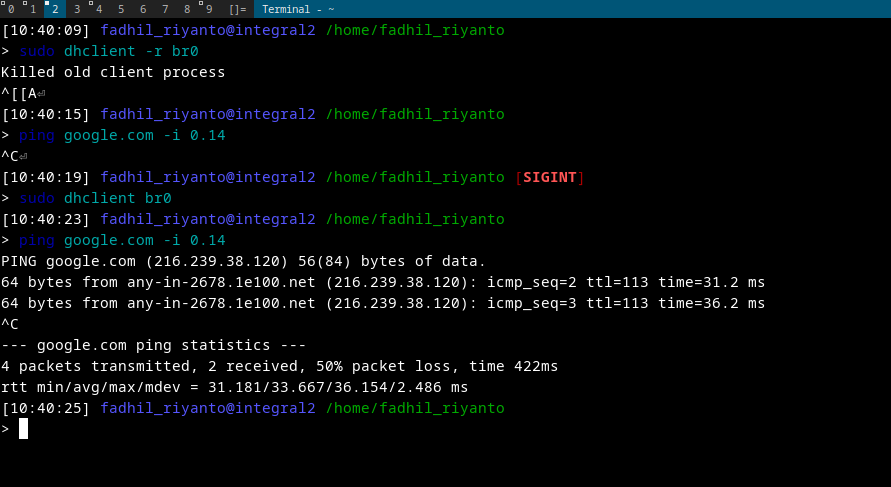

# Setup bridge enp0s16u1

- setup dulu bridgenya pakai `ip link add br0 type bridge`
- buat enp0s16u1 sebagai master dari br0, pakai `ip link set enp0s16u1 master br0`
	- catatan, wlan0 tidak bisa di add. [https://bbs.archlinux.org/viewtopic.php?id=264651](https://bbs.archlinux.org/viewtopic.php?id=264651), [https://wiki.archlinux.org/title/Network_bridge#Wireless_interface_on_a_bridge](https://wiki.archlinux.org/title/Network_bridge#Wireless_interface_on_a_bridge)
- lalu enable semua interface nya
	- `sudo ip link set dev enp0s16u1 up`
	- `sudo ip link set dev br0 up`
- set dhcp `sudo dhclient br0`
	- nb, ditahap ini, harusnya sudah dapat ip dan bisa ping keluar.
- hapus ip bawaan enp0s16u1 dan pakai br0 sebagai default interface pakai `sudo ip addr flush dev enp0s16u1`

bisa di test dengan
- hapus dahulu ip yang tadi diberikan ke br0 pakai `sudo dhclient -r br0`, pastikan ip nya kosong
- lalu hapus ip milik enp0s16u1
- test ping
- lalu lakukan lagi `sudo dhclient br0`



# reverse command
Pakai ini untuk in-case ada kesalahan
## hapus ip br0
- `ip addr show br0`
- `sudo ip addr del 192.168.1.10/24 dev br0`

tambahan, kadang tidak bener2 kehapus karna mungkin NetworkManager, systemd-networkd, dhclient aktif.


nb: untuk dhcp kadang NetworkManager sama systemd-networkd bertabrakan, solusinya stop dahulu pakai
- `sudo systemctl stop systemd-networkd.socket`
- `sudo systemctl stop systemd-networkd`

# next, buat bridge ke VM. topologi
```
   [Internet]
       |
     Router
       |
     eth0 (on host) → br0 (bridge)
                      |
    +--------+--------+--------+
    |        |        |        |
  VM1      VM2      VM3      etc.
  ↳ 192.168.12.101   192.168.12.102   ...

```

mulai dari sini akan utak atik `veth`

# setup veth manual
- `sudo ip link add veth0 type veth peer name veth0-peer`
- `sudo ip link set veth0 master br0`
- `sudo ip link set veth0 up`
- `sudo ip link set veth0-peer up`
- `sudo dhclient veth0-peer`

topologinya kira2 seperti ini

```
                +---------------------------+
                |        Linux Host         |
                |                           |
                |   +-------------------+   |
                |   |       br0         |   |  ← bridge acting as a virtual switch
                |   +--------+----------+   |
                |            |              |
                |         veth0            ... ← more veths for other containers/VMs
                |            |
                +------------+--------------+
                             |
                             | (virtual cable)
                             |
                         veth0-peer
                             |
                    +------------------+
                    |   Container/VM   |  ← gets its own IP
                    +------------------+

```

# lanjut assign veth-peer ke qemu (pakai tap device)

topology:
```
            Linux Host
       +------------------+
       |      br0         |  ← acts as switch
       +--+-----------+---+
          |           |
        eth0         tap0  ← tap device for QEMU VM
                        |
                   QEMU VM

```

attach
```sh
sudo ip tuntap add dev tap0 mode tap
sudo ip link set tap0 up
sudo ip link set tap0 master br0
```

qemu
```
sudo qemu-system-x86_64 \
  -enable-kvm \
  -m 2048 \
  -hda ubuntu.qcow2 \
  -netdev tap,id=net0,ifname=tap0,script=no,downscript=no \
  -device virtio-net-pci,netdev=net0

```

test qemu mikrotik
```sh
qemu-system-x86_64 \
                -enable-kvm \
                -boot order=d \
                -drive file=chr.qcow2,format=qcow2 \
                -m 4G \
                -smp 4 \
                -net user,hostfwd=tcp::10022-:22,hostfwd=tcp::8080-:8080 \
                -netdev tap,id=net0,ifname=tap0,script=no,downscript=no \
                -device virtio-net-pci,netdev=net0
```

untuk test nya, bisa dengan
- cek ip mikrotik pakai `/ip address print`
- lalu ` ip netns exec namespace_satu ping <IP NYA>`
- Bisa juga pakai dummy http server php, caranya `sudo ip netns exec namespace_satu php -S 192.168.12.82:1234` (cek dahulu ip namespace pakai ip addr)

# contoh setup pakai namespace 
- create dulu pakai `sudo ip netns add namespace_satu`
- set `sudo ip link set veth0-peer netns namespace_satu`
- cek dahulu, pastikan didalamnnya masih kosong ip nya, pakai `sudo ip netns exec namespace_satu ip addr`

- lalu kita nyalakan veth0-peer nya `sudo ip netns exec namespace_satu ip link set dev veth0-peer up`, tapi tetap saja masih belum dapat ip. maka next kita exec dhclient pakai `sudo ip netns exec namespace_satu dhclient veth0-peer`

- test ping keluar


