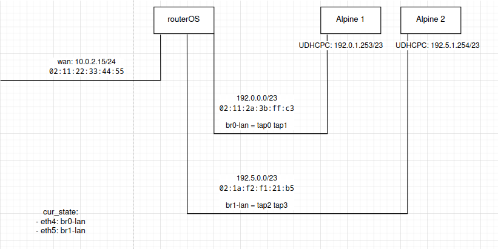
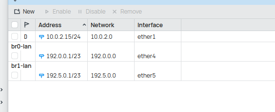
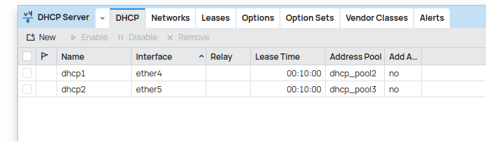
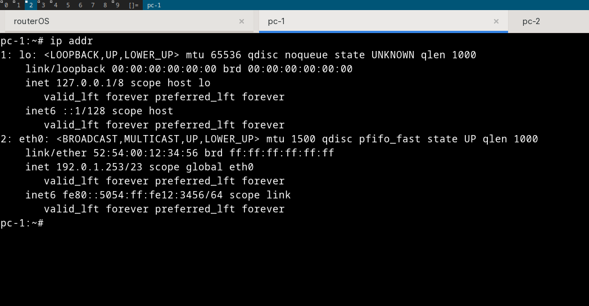
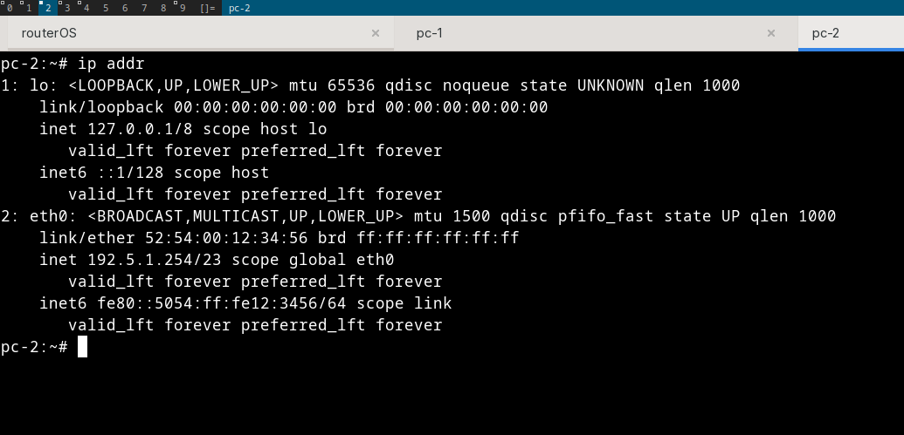

# setup linux bridge between RouterOS & Alpine linux hosts

this docs is second part of [this](http://localhost:3000/server/alpine_install_on_live_cd_qemu.html)

first thing that we need to do is create a copy of qcow2 alpine, so we do not need to re-install again. do not forget to change the hostname & password for easy identification

# setup bridge
- `sudo ip link add br0-lan type bridge`
- `sudo ip link add br1-lan type bridge`

# setup TAP
tap0 & tap1 connected to br0-lan
tap2 & tap3 connected to br1-lan

- `sudo ip tuntap add dev tap0 mode tap`
- `sudo ip tuntap add dev tap1 mode tap`
- `sudo ip tuntap add dev tap2 mode tap`
- `sudo ip tuntap add dev tap3 mode tap`
- `sudo ip link set tap0 master br0-lan`
- `sudo ip link set tap1 master br0-lan`
- `sudo ip link set tap2 master br1-lan`
- `sudo ip link set tap3 master br1-lan`
- `sudo ip link set tap0 up`
- `sudo ip link set tap1 up`
- `sudo ip link set tap2 up`
- `sudo ip link set tap3 up`

# launch mikrotik ISO
```sh
qemu-system-x86_64 \
      -enable-kvm \
      -boot order=d \
      -drive file=chr.qcow2,format=qcow2 \
      -m 256M \
      -smp 4 \
      -netdev tap,id=net0,ifname=tap0,script=no,downscript=no \
      -device virtio-net-pci,netdev=net0,mac=02:11:2a:3b:ff:c3  \
      -netdev tap,id=net1,ifname=tap2,script=no,downscript=no \
      -device virtio-net-pci,netdev=net1,mac=02:1a:f2:f1:21:b5  \
      -nographic \
      -net user,hostfwd=tcp::10022-:22,hostfwd=tcp::8291-:8291 \
      -net nic
```



based on topology, we know that

- `02:11:2a:3b:ff:c3` used by tap0 (in routerOS, bridge 0)
- `02:1a:f2:f1:21:b5` used by tap2 (in routerOS, bridge 1)
- `tap1` & `tap3` used by alpine virtual machine

now run alpine iso

# alpine (as pc-1)
```sh
qemu-system-x86_64 \
            -enable-kvm \
            -m 256 \
            -smp 4 \
            -cpu host \
            -drive file=pc-1.qcow2,format=qcow2 \
            -cdrom alpine-virt-3.21.3-x86_64.iso \
            -boot d \
            -nographic \
            -netdev tap,id=net0,ifname=tap1,script=no,downscript=no \
            -device virtio-net-pci,netdev=net0
```

# alpine (as pc-3)
```sh
qemu-system-x86_64 \
            -enable-kvm \
            -m 256 \
            -smp 4 \
            -cpu host \
            -drive file=pc-2.qcow2,format=qcow2 \
            -cdrom alpine-virt-3.21.3-x86_64.iso \
            -boot d \
            -nographic \
            -netdev tap,id=net0,ifname=tap3,script=no,downscript=no \
            -device virtio-net-pci,netdev=net0
```

# WinBox config
first, we need to see the configuration & which etherX by looking to spesific mac-addr, we find out that

```
[admin@MikroTik] > /interface print
Flags: D - dynamic, X - disabled, R - running, S - slave 
 #     NAME                                TYPE       ACTUAL-MTU L2MTU  MAX-L2MTU MAC-ADDRESS      
 0  R  ;;; wan
       ether1                              ether            1500                  52:54:00:12:34:56
 1  R  ether4                              ether            1500                  02:11:2A:3B:FF:C3
 2  R  ether5                              ether            1500                  02:1A:F2:F1:21:B5
[admin@MikroTik] > 
```
next thing, lets configure our ip using winbox, this is ip configuration


DHCP server section


now, try run `udhcpc -i eth0` on each vm

# result on pc-1


# result on pc-2
