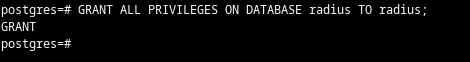
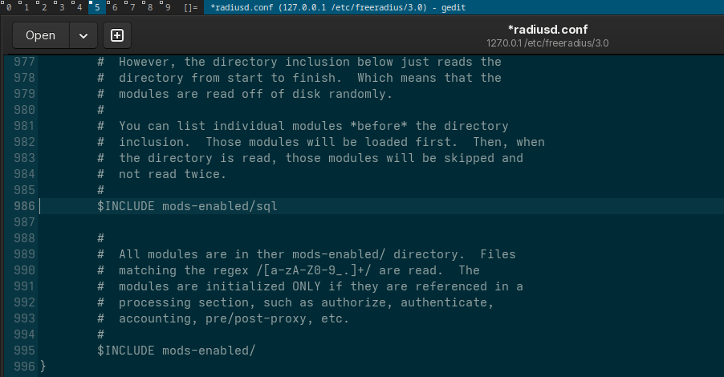
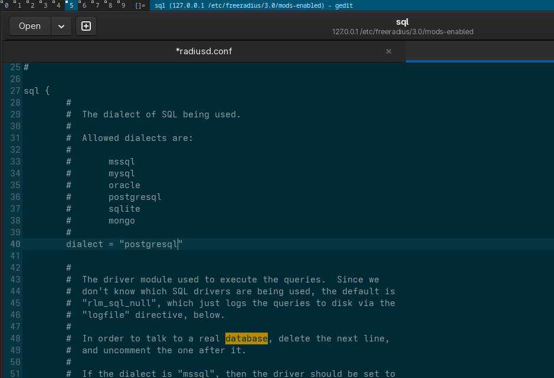
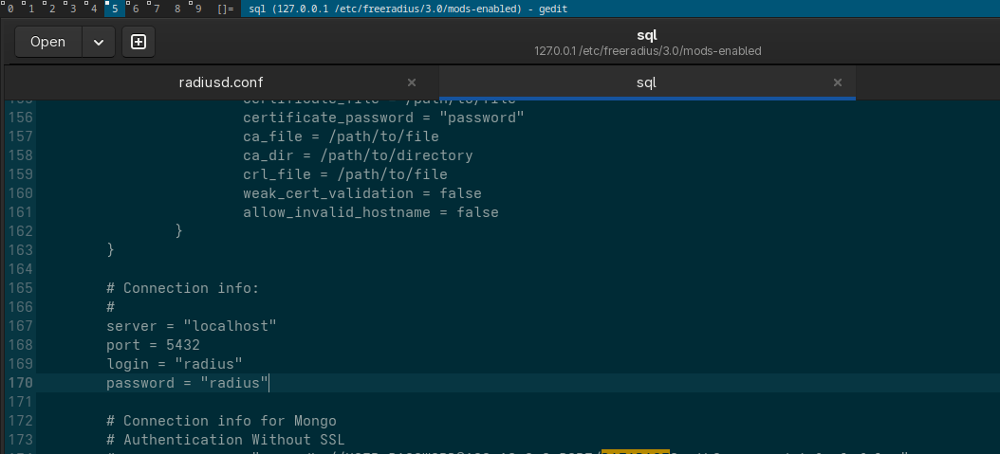
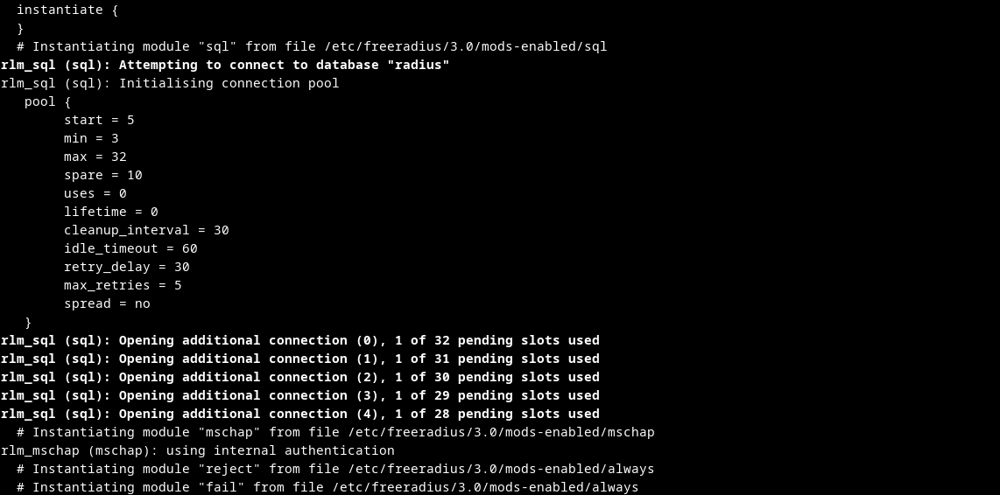
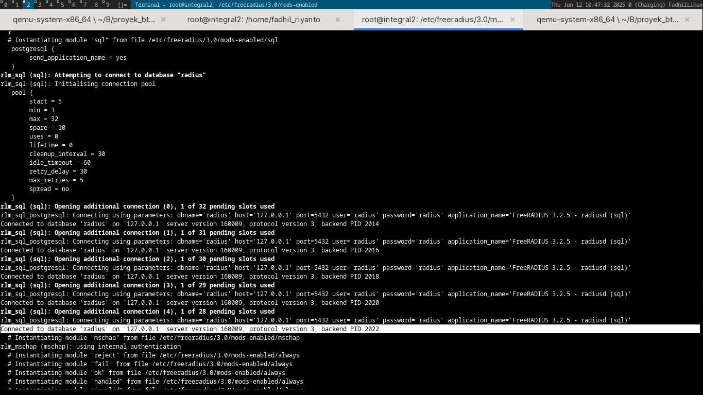
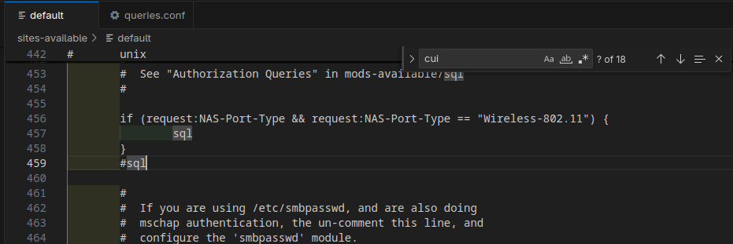
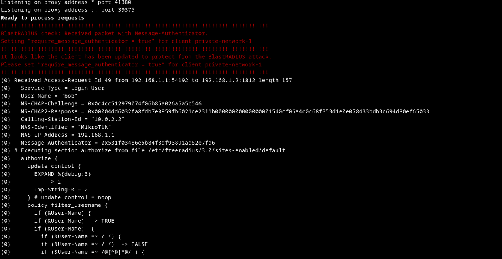
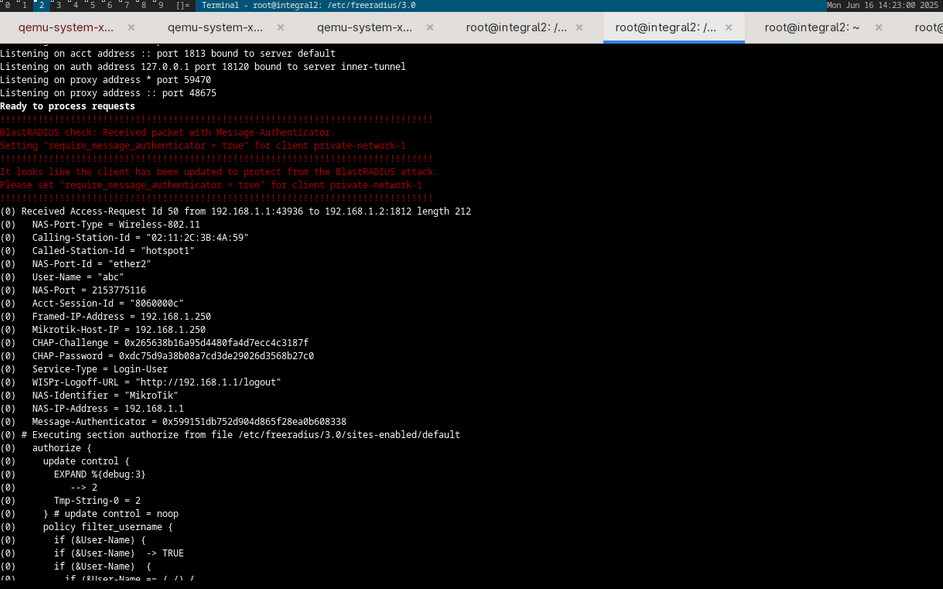

# SQL authentication freeradius server

first, desclaimer. I use Ubuntu 24.04.2 LTS that running on Archlinux qemu host. so this is not host machine.
big thanks for linux netdev that makes local networking possible.

first, lets configure postgresql server 

```sh
root@integral2:/home/fadhil_riyanto# su postgres
postgres@integral2:/home/fadhil_riyanto$ psql
psql (16.9 (Ubuntu 16.9-0ubuntu0.24.04.1))
Type "help" for help.

postgres=# 
```
## database setup

get it inside. then run





do not forget to allow CRUD option on all tables by running

```sql
GRANT ALL PRIVILEGES ON ALL TABLES IN SCHEMA public TO radius;
```

## radius server configuration 

the sequence of config file

- `/etc/freeradius/3.0/clients.conf` <-- specify 'who' can connect, we need define it in this file
- `/etc/freeradius/3.0/users` <-- [manual authentication, using file]
- `/etc/freeradius/3.0/radiusd.conf:986` <-- this file enable sql module.
- `/etc/freeradius/3.0/mods-available/sql` <-- this file is where we configure user/pass for sql module
- `/etc/freeradius/3.0/sites-available/default` <-- sequence layer of login, 
	- first, we filter-out all args
	- then go to preprocess
	- send to log
	- chap & mschap
	- check whatever has digest
	- check whatever user@domain format
	- eap
	- files
	- lookup to sql <-- uncomment this

as root

- `/etc/freeradius/3.0/mods-enabled`
- `ln -s ../mods-available/sql ./sql`
- uncomment this line in radiusd.conf

- change this line to postgresql (mods-enabled/sql)


also 

- fill the pgsql server credentials (/etc/freeradius/3.0/mods-config/sql/main/postgresql/queries.conf) (aka raddb/sql/database/dialup.conf in rhel)



### when connection failed


### when connection succeed


# populating
best read: [https://wiki.freeradius.org/guide/SQL-HOWTO#populating-sql](https://wiki.freeradius.org/guide/SQL-HOWTO#populating-sql)

big thanks for freeradius developer, the sql file is located at `/etc/freeradius/3.0/mods-config/sql/main/postgresql/schema.sql`

import it with: 

```sql
psql -U radius -d radius -f /etc/freeradius/3.0/mods-config/sql/main/postgresql/schema.sql
```

# configuration
lets look at `sites-available/default`



this configuration only allow authorize users that come from NAS-Port-Type == "Wireless-802.11", this is the difference

footage 1: from winbox request


this one come from captive portal
