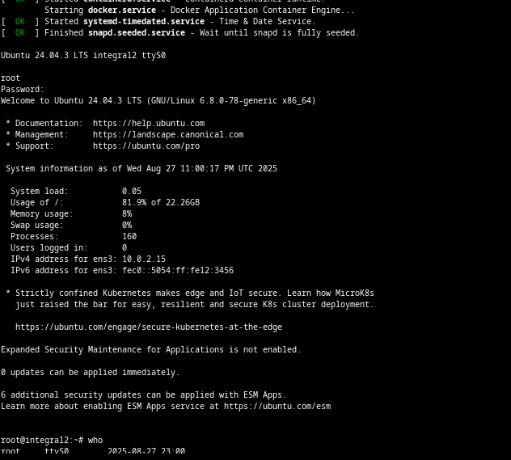
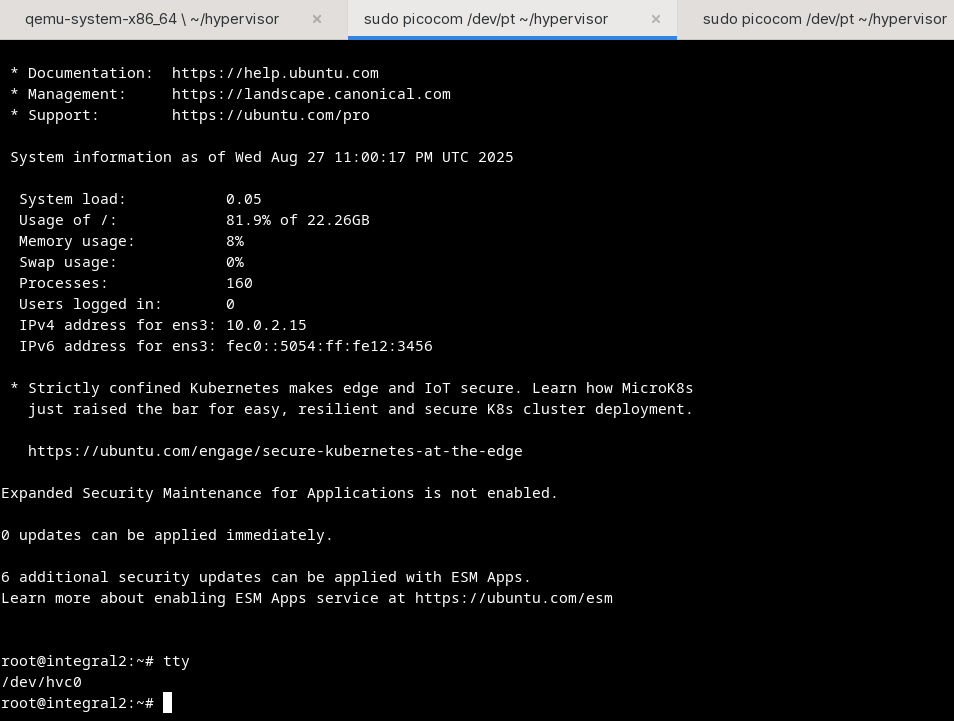
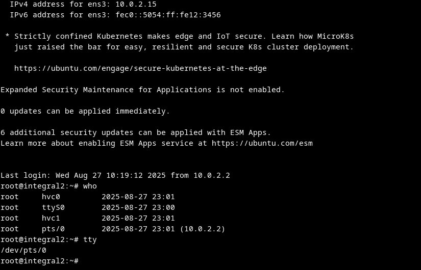

# tty device driver

- `/dev/tty*`: TTY stands of teletype, see [wiki Teleprinter](https://en.wikipedia.org/wiki/Teleprinter)
- `/dev/ttyS*`: TTY over serial, new version
- `/dev/hvc*`: hypervisor console, usually in virtualization env
- `/dev/pts*`: pseudoterminal, this is ssh or virtual emulator.

example
## ttyS

## hvc
im in HVC

## pts

im on ssh
