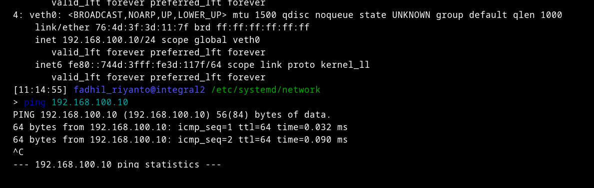

# Setup virtual network interface

cara setup virtual ethernet + assign ip nya
- `sudo ip link add veth0 type dummy`

bisa dicek pakai `ip addr`
```
[11:11:35] fadhil_riyanto@integral2 /etc/systemd/network  
> ip addr
1: lo: <LOOPBACK,UP,LOWER_UP> mtu 65536 qdisc noqueue state UNKNOWN group default qlen 1000
    link/loopback 00:00:00:00:00:00 brd 00:00:00:00:00:00
    inet 127.0.0.1/8 scope host lo
       valid_lft forever preferred_lft forever
    inet6 ::1/128 scope host noprefixroute 
       valid_lft forever preferred_lft forever
2: enp2s0: <NO-CARRIER,BROADCAST,MULTICAST,UP> mtu 1500 qdisc fq_codel state DOWN group default qlen 1000
    link/ether 2c:4d:54:c6:f2:0c brd ff:ff:ff:ff:ff:ff
    altname enx2c4d54c6f20c
3: wlan0: <BROADCAST,MULTICAST,UP,LOWER_UP> mtu 1500 qdisc noqueue state UP group default qlen 1000
    link/ether f0:03:8c:66:9c:21 brd ff:ff:ff:ff:ff:ff
    inet 192.168.5.44/24 brd 192.168.5.255 scope global dynamic noprefixroute wlan0
       valid_lft 581sec preferred_lft 581sec
    inet 192.168.5.197/24 metric 1024 brd 192.168.5.255 scope global secondary dynamic wlan0
       valid_lft 582sec preferred_lft 582sec
    inet6 fe80::5574:5771:be47:2f7b/64 scope link noprefixroute 
       valid_lft forever preferred_lft forever
    inet6 fe80::f203:8cff:fe66:9c21/64 scope link proto kernel_ll 
       valid_lft forever preferred_lft forever
4: veth0: <BROADCAST,NOARP,UP,LOWER_UP> mtu 1500 qdisc noqueue state UNKNOWN group default qlen 1000
    link/ether 76:4d:3f:3d:11:7f brd ff:ff:ff:ff:ff:ff
    inet6 fe80::744d:3fff:fe3d:117f/64 scope link proto kernel_ll 
       valid_lft forever preferred_lft forever

```

lalu assign ip nya
- `sudo ip addr add 192.168.100.10/24 dev veth0`
- `sudo ip link set veth0 up`

dan bisa diping juga


untuk remove interface nya bisa pakai
`sudo ip link delete vnet0`

# some sorts of equalivalent command

- Create bridge: `brctl addbr br0` `ip link add br0 type bridge`
- Delete bridge: `brctl delbr br0`   ip link delete br0
- Add interface to bridge: `brctl addif br0 eth0` ip link set eth0 master br0
- Remove interface from bridge: `brctl delif br0 eth0` ip link set eth0 nomaster
- Show bridge info: `brctl show` or `brctl show br0`  `bridge link show` or `ip link show master br0`
- Enable/disable STP: `brctl stp br0 on/off` `bridge link set dev eth0 guard off/on` (note: STP enable/disable logic is reversed)