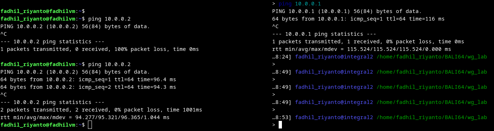

# wireguard setup

# Peer A

```txt
wg genkey > peer_A.key
wg pubkey < peer_A.key > peer_A.pub
sudo ip link add dev wg0 type wireguard
sudo ip addr add 10.0.0.1/24 dev wg0
sudo wg
sudo wg set wg0 private-key ./peer_A.key
sudo wg set wg0 peer wkUbsVDVx4ljxY0lhf6PKE0r8yDD3QWZZSCz2NB9Bmw= allowed-ips 10.0.0.2/32 endpoint 103.246.107.2:43358
```

# Peer B

```txt
wg genkey > peer_B.key
wg pubkey < peer_B.key > peer_b.pub
sudo ip link add dev wg0 type wireguard
sudo ip addr add 10.0.0.2/24 dev wg0
sudo wg
sudo wg set wg0 private-key ./peer_B.key
wg set wg0 peer mCTr2nPVOAghT5QlxeXUJel9Bm4lGATlxWSzchrjIg4= allowed-ips 10.0.0.1/32 endpoint 20.2.200.57:49503
```


proof of concept (context: CG-NAT)

