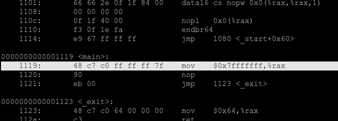
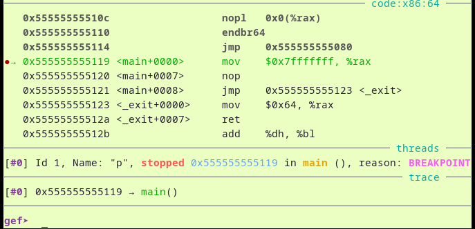
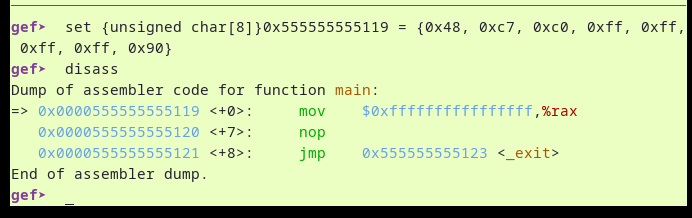
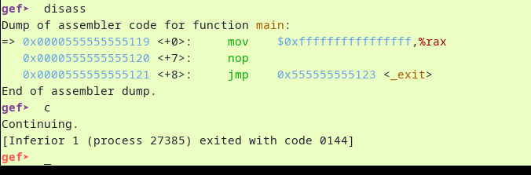

# analisis patch movq pakai 0xffffffff

ada asm



kita akan memaksa dari 0x7fffffff menjadi 0xffffffff untuk membuktikan bahwa harusnya movq error, dan digantikan oleh movabsq

initial dulu


lalu, next replace address 0x555555555119 dengan 
```
set {unsigned char[8]}0x555555555119 = {0x48, 0xc7, 0xc0, 0xff, 0xff, 0xff, 0xff, 0x90}
```

confirmed berubah jadi 0xffffffff disini


saatnya kita lanjutkan, apakah error
