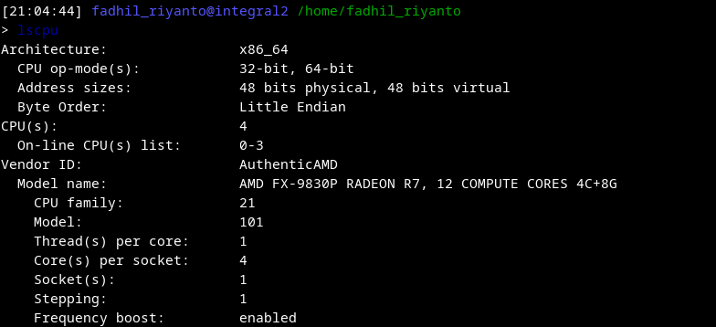
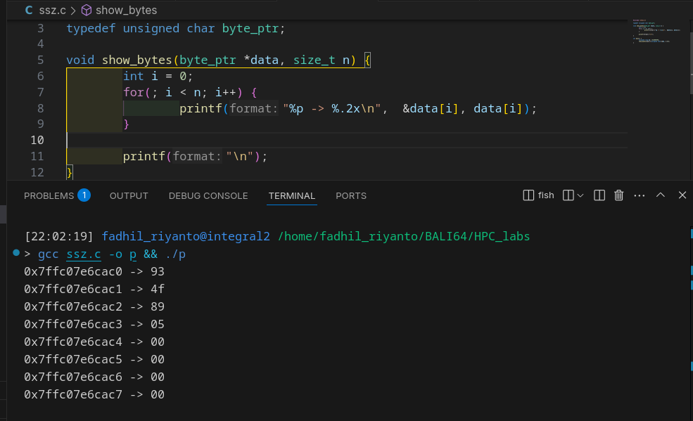
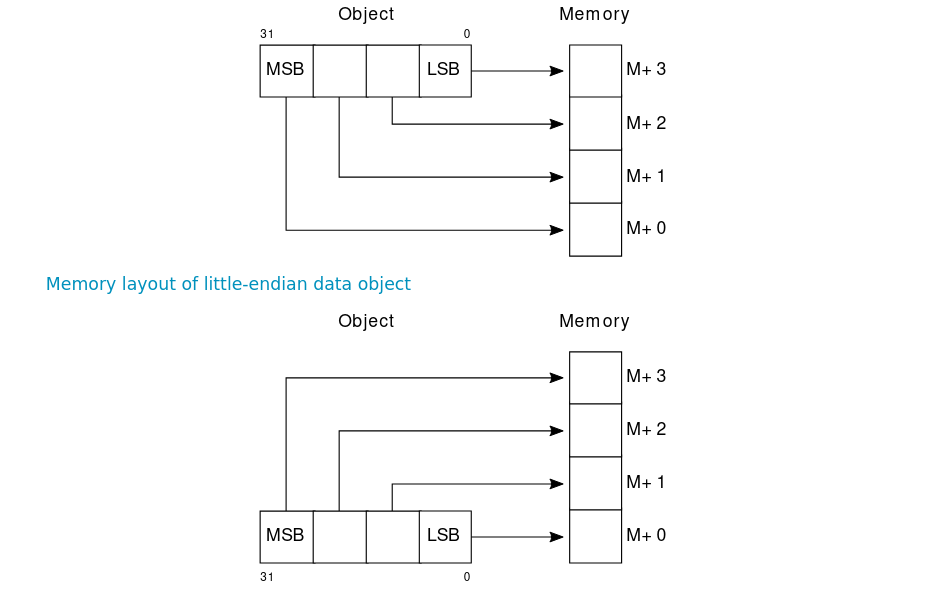
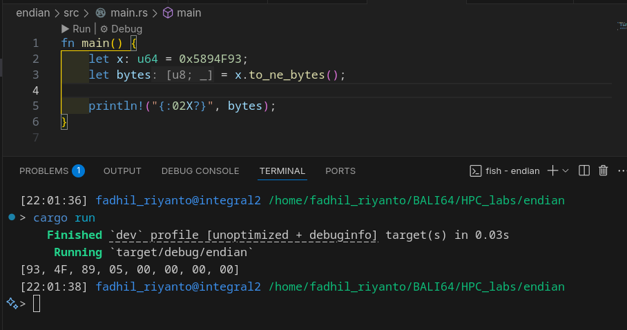
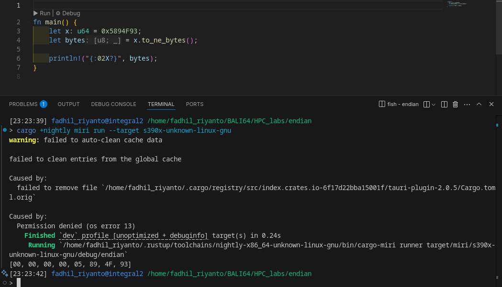

# amd64 endianness

I'll show you, the little endian (that used in most x86-64 linux systems), let go deeper

I have very simple program, the program

```c
#include <stdio.h>

typedef unsigned char byte_ptr;

void show_bytes(byte_ptr *data, size_t n) {
        int i = 0;
        for(; i < n; i++) {
                printf("%p -> %.2x\n",  &data[i], data[i]);
        }

        printf("\n");
}

int main() {
        unsigned long da = 0x5894F93;
        show_bytes((unsigned char*)&da, 8);
}
```

as you can see, this is what we write

```
hexadecimal	: 0x05 0x89 0x4F 0x93
dummy addr  : 0    1    2    3
```
the result

```
0x7fff0fe80d10 -> 93
0x7fff0fe80d11 -> 4f
0x7fff0fe80d12 -> 89
0x7fff0fe80d13 -> 05
0x7fff0fe80d14 -> 00
0x7fff0fe80d15 -> 00
0x7fff0fe80d16 -> 00
0x7fff0fe80d17 -> 00
```

wow, it reversed!, because
```
hexcode      : 0x93 0x4f 0x89 0x05 0x00 0x00 0x00 0x00
dummy addr   : 0    1    2    3    4    5    6    7
               ^~~ MSB                            ^~~ LSB
```

(read it first from right, to left, as you read binary code)
WOW, its least endian first, so the machine is `little-endian`

you can also check out my lscpu result






## rust

result


# big endian 

because most of machine is little-endian, even RP2040 ARM chip, I'll demontrate it (with some stuff)

first, I'll use miri

## miri

this unique tool can emulate big endian
