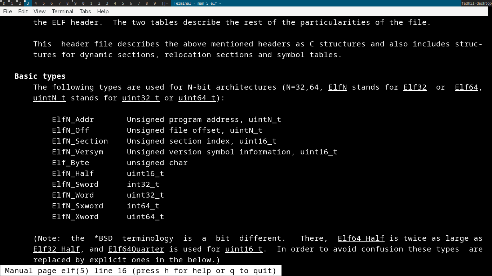
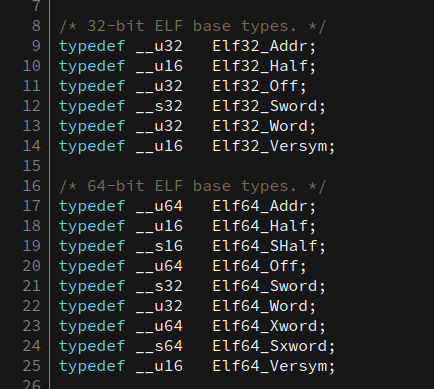

# ELF struct datatype



recently, I had confusion about ELF datatype. let's look into elf.h



see it?

```c
// 32 bit elf
typedef __u32	Elf32_Word;

// 64 bit elf
typedef __u32	Elf64_Word;
```

why word? even in assembly says

- 8 bit -> byte
- 16 bit -> word
- 32 bit -> dword
- 64 -> qword

why word (that is 16 bit), its uses u32 instead u16?

# answer
the key is portability. lets look at elf64 and elf32 

```c
typedef __u32	Elf32_Word;
typedef __u32	Elf64_Word;
```

keep in mind that word (in ELF) is 32 bit int. so we use this convention

- half -> unsigned 16 bit
- word -> unsigned 32 bit
- Xword -> unsigned 64 bit

also works for
- Shalf -> signed 16 bit
- Sword -> signed 32 bit
- Sxword -> signed 64 bit