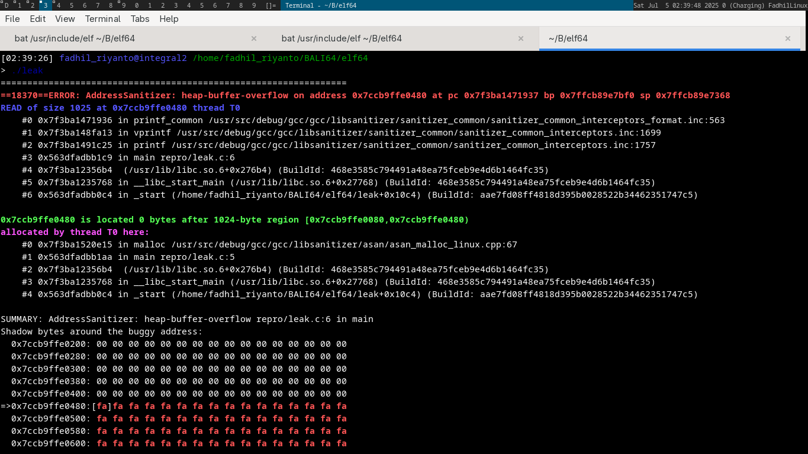
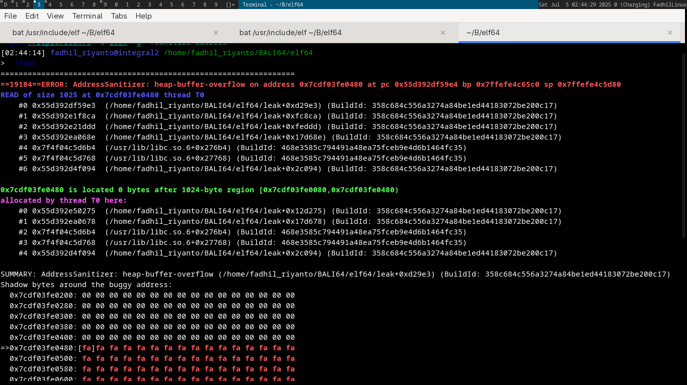
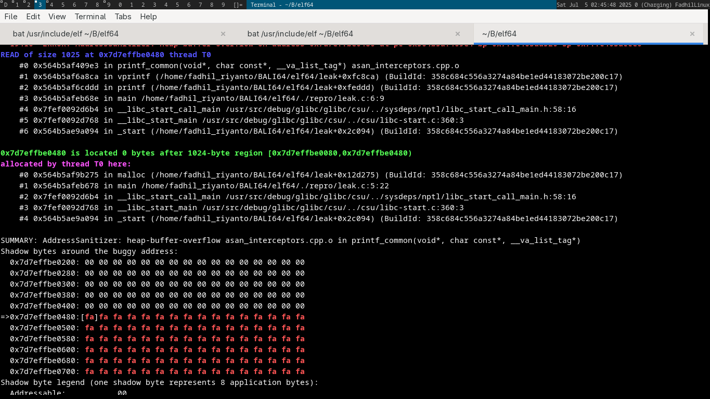

# all about ASan & debug symbol

## prerequisites

if you use clang infrastructure
- [llvm-symbolizer](https://man.archlinux.org/man/llvm-symbolizer.1.en): without this, asan offset at debug output will be binary offset, not actual source code. I will demonstrate it
- clang

if you use GCC
- addr2line (usually preinstalled)
- gcc

the tools
- gdb (optional)
- [address sanitizer](https://github.com/google/sanitizers.git)

## testing

very simple memory buggy program

```c
#include <stdlib.h>
#include <stdio.h>

int main() {
        char* data = malloc(1024);
        printf("%s", data);
        return 0;
}
```

`gcc ./leak.c -o leak -g -fsanitize=address`

here buggy result


lets compile it with clang
`clang ./leak.c -o leak -g -fsanitize=address`



after llvm-symbolizer installed
