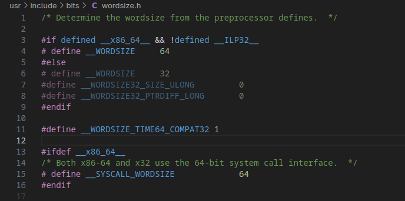
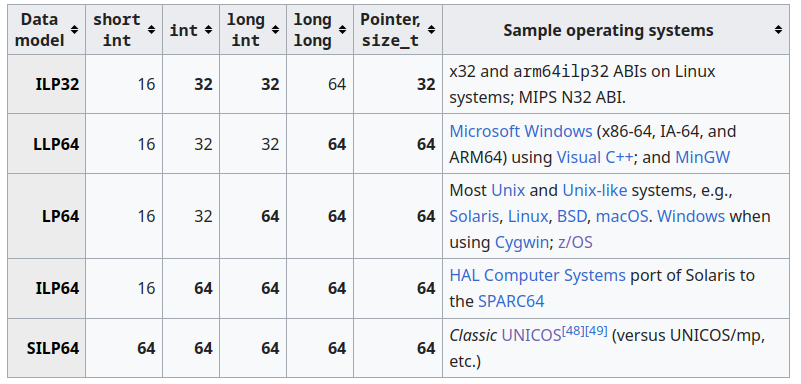

# bits data models

this section will talk about data models.



that footage, show us what `__ILP32__` is, also what is ILP32?

There has some nice websites
- [https://duetorun.com/blog/20211008/data-model/#concept](https://duetorun.com/blog/20211008/data-model/#concept)
- [https://gcc.gnu.org/onlinedocs/gccint/Effective-Target-Keywords.html#Data-type-sizes](https://gcc.gnu.org/onlinedocs/gccint/Effective-Target-Keywords.html#Data-type-sizes)



for example, most linux system uses LP64, which long int, and pointer are 64 bit wide. the other example is ILP32, which used by `arm64ilp32`, but its deprecated [https://gcc.gnu.org/pipermail/gcc-patches/2025-January/673207.html](https://gcc.gnu.org/pipermail/gcc-patches/2025-January/673207.html)

LP64 and ILP32 refer to the data model used by the language. "I" is an abbreviation that represents int type, "L" represents long type, and "P" represents the pointer type. 64 and 32 refer to the size of the data types. When the ILP32 option is used, int, long and pointers are 32-bit in size. When LP64 is used, long and pointer are 64-bit in size; int remains 32-bit. The addressing mode used by LP64 is AMODE 64, and by ILP32 is AMODE 31. In the latter case, only 31 bits within the pointer are taken to form the address. For the sake of conciseness, the terms 31-bit mode and ILP32, will be used interchangeably in this document when there is no ambiguity. The same applies to 64-bit mode and LP64. [see here](https://www.ibm.com/docs/en/zos/2.4.0?topic=options-lp64-ilp32#d41843e90)

# Common data models
| Model      | `int`  | `long` | `pointer` | Common in                           |
| ---------- | ------ | ------ | --------- | ----------------------------------- |
| **ILP32**  | 32-bit | 32-bit | 32-bit    | x86 (32-bit), ARM32, MIPS32         |
| **LP64**   | 32-bit | 64-bit | 64-bit    | x86\_64 (Linux, macOS), AArch64     |
| **LLP64**  | 32-bit | 32-bit | 64-bit    | Windows x64 (MSVC), long long is 64 bit|
| **ILP64**  | 64-bit | 64-bit | 64-bit    | Rare: Cray supercomputers, some HPC |
| **SILP64** | 16-bit | 64-bit | 64-bit    | Very rare, some historic systems    |
| **LP32**   | 16-bit | 32-bit | 32-bit    | Some embedded systems               |

# check
```c
#include <stdio.h>

int main() {
    printf("sizeof(int): %zu\n", sizeof(int));
    printf("sizeof(long): %zu\n", sizeof(long));
    printf("sizeof(void *): %zu\n", sizeof(void *));
}
```

intresting topics
- https://www.ibm.com/docs/en/zos/2.4.0?topic=options-lp64-ilp32#d41843e90
- LP64 also predefined, see https://gcc.gnu.org/onlinedocs/cpp/Common-Predefined-Macros.html