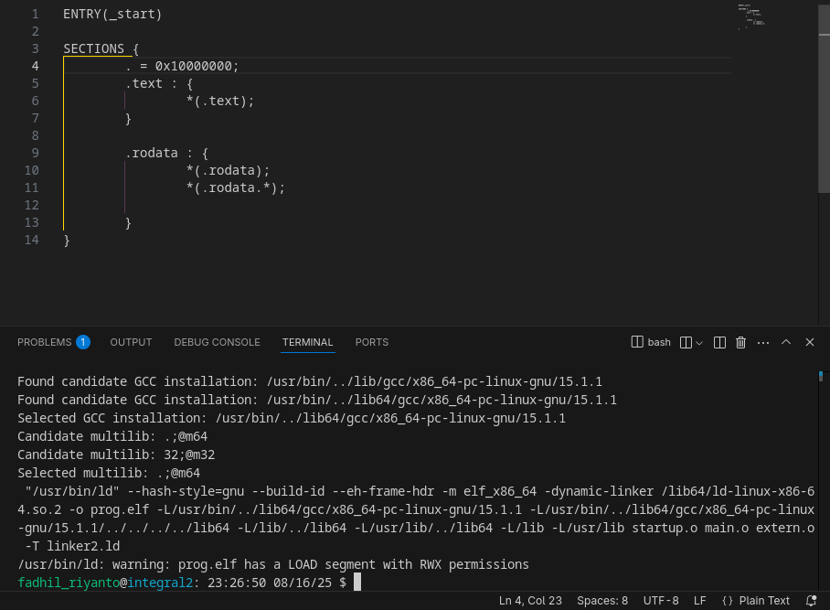
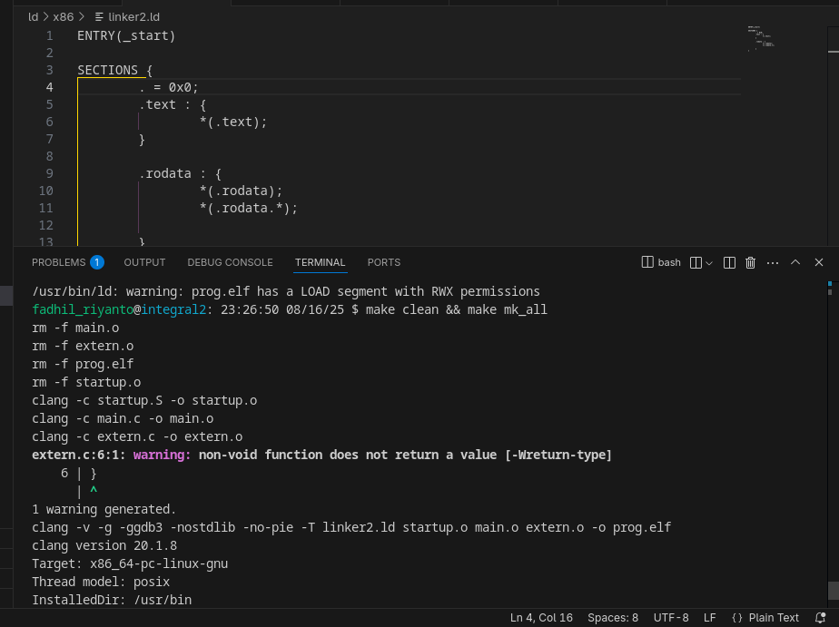
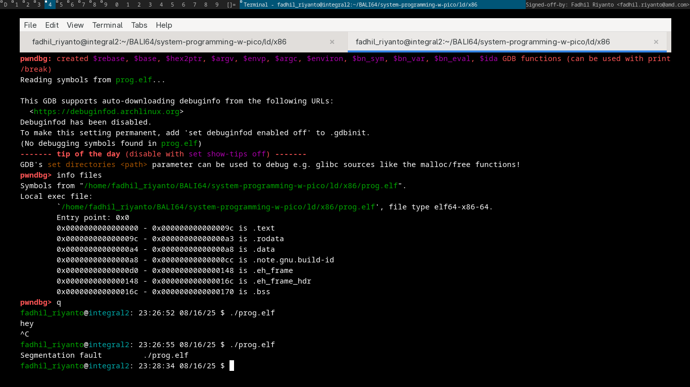
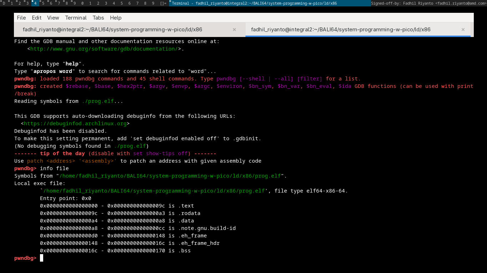

# debug crash before runtime

thanks for [https://stackoverflow.com/questions/7808769/how-to-debug-a-crash-before-main/30142423#30142423](https://stackoverflow.com/questions/7808769/how-to-debug-a-crash-before-main/30142423#30142423)

let's break a thing!

this is normal program, the `_start` is on 0x10000000, let break it 

as you can see, its start from 0x0, let run it

notes: the hey is previos attempt. nvm, now how debug it

# run as usual GDB

here the entrypoint is 0x0