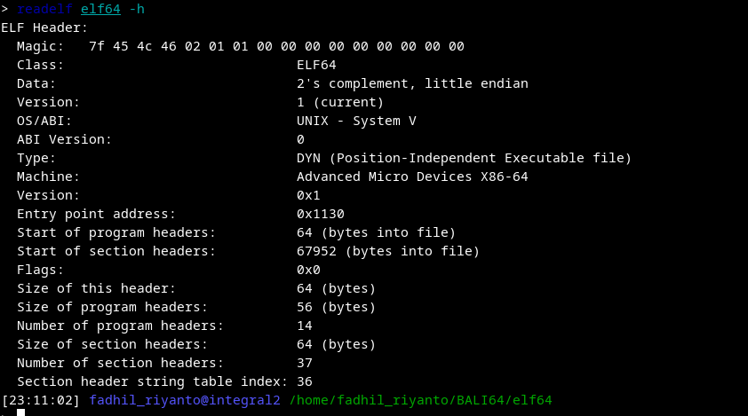
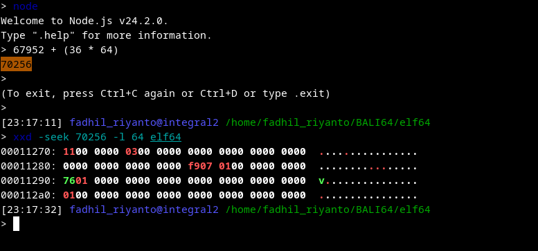
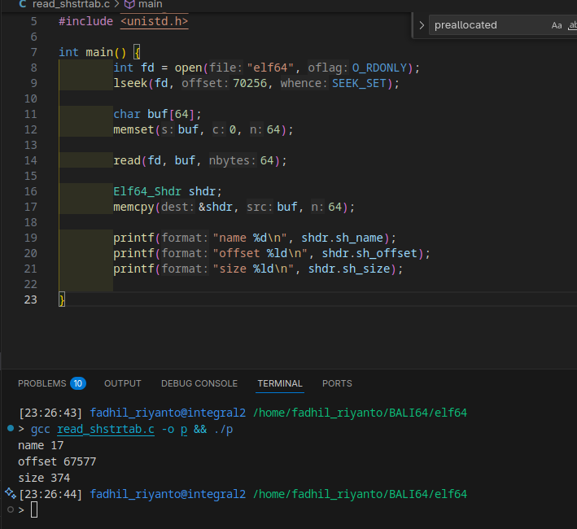
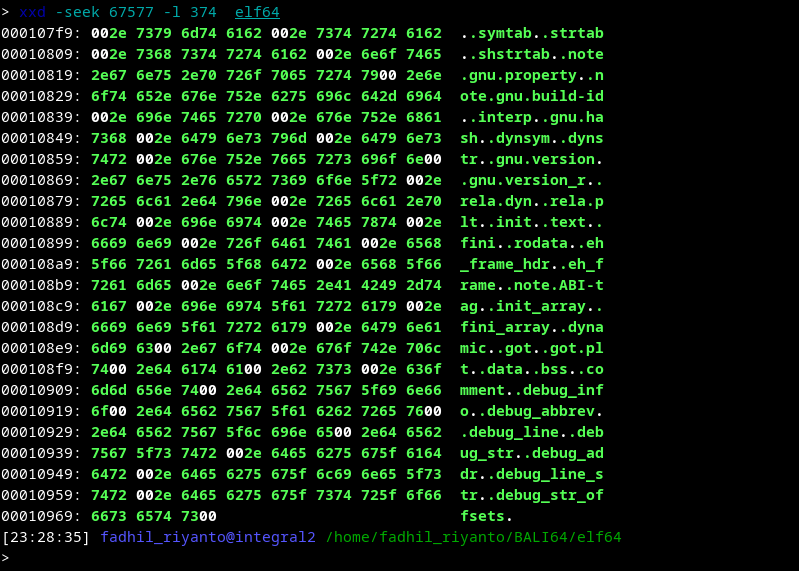

# finding .shstrtab section

first, we need to look at some struct in order to find shstrtab on ELF file


this is ELF header
```c
typedef struct
{
  unsigned char	e_ident[EI_NIDENT];	/* Magic number and other info */
  Elf64_Half	e_type;			/* Object file type */
  Elf64_Half	e_machine;		/* Architecture */
  Elf64_Word	e_version;		/* Object file version */
  Elf64_Addr	e_entry;		/* Entry point virtual address */
  Elf64_Off	e_phoff;		/* Program header table file offset */
  Elf64_Off	e_shoff;		/* Section header table file offset */
  Elf64_Word	e_flags;		/* Processor-specific flags */
  Elf64_Half	e_ehsize;		/* ELF header size in bytes */
  Elf64_Half	e_phentsize;		/* Program header table entry size */
  Elf64_Half	e_phnum;		/* Program header table entry count */
  Elf64_Half	e_shentsize;		/* Section header table entry size */
  Elf64_Half	e_shnum;		/* Section header table entry count */
  Elf64_Half	e_shstrndx;		/* Section header string table index */
} Elf64_Ehdr;
```

this is section header
```c
typedef struct
{
  Elf64_Word	sh_name;		/* Section name (string tbl index) */
  Elf64_Word	sh_type;		/* Section type */
  Elf64_Xword	sh_flags;		/* Section flags */
  Elf64_Addr	sh_addr;		/* Section virtual addr at execution */
  Elf64_Off	sh_offset;		/* Section file offset */
  Elf64_Xword	sh_size;		/* Section size in bytes */
  Elf64_Word	sh_link;		/* Link to another section */
  Elf64_Word	sh_info;		/* Additional section information */
  Elf64_Xword	sh_addralign;		/* Section alignment */
  Elf64_Xword	sh_entsize;		/* Entry size if section holds table */
} Elf64_Shdr;
```

# finding it
first, we need obtain how much we need to walk, to enter the start of `section header`, this is can be done by 



keep your mind in "Start of section headers"

# access the array
because this is just start, so its started on index 0, luckly the ELF header tell me, what index `.shstrtab` is located, look at "Section header string table index". its 36

in C you may doing

```c
Elf64_Shdr data = /* any data */;
dump(data[36]);
```

but in binary level, which what you should do is calculating how far away we need to walk from start  to index of 36, which can be done by `36 * sizeof(Elf64_Shdr)`, in this case, this is same as `36 * ehdr->e_shentsize`, then add it with initial offset where Shdr start off.

final formula
`ehdr->e_shoff + (shstrtab_idx * ehdr->e_shentsize)`

# tests
this is how shdr at index 36 look like (at binary view)



lets map it into C code for better readibility


we know that, in current section header array, `.shstrtab` located on 67577 far away from 0, that is location of actual `.shstrtab`, the Shdr only create a "list of section table, what section in this binary". 

also, `374` is the size, how many memory you need to spend for this a bunch of string. 

lets jump to `67577`

# xxd stuff


found!

# future
you just need to map `Elf64_Shdr` on section `sh_name` which this data. `sh_name` is a offset how much we walk from 67577 until we found \0