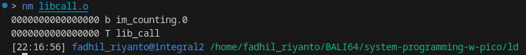
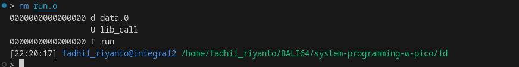
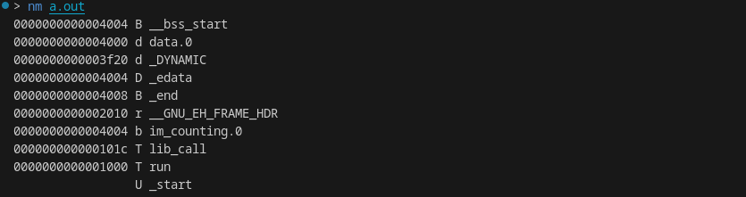
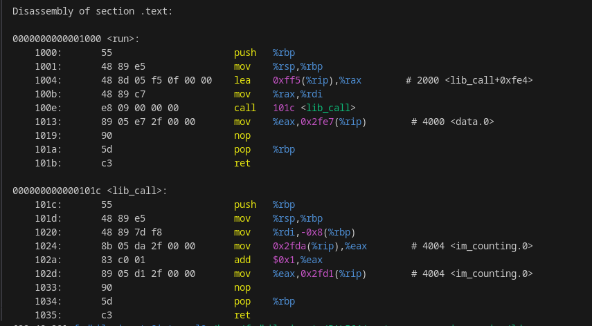

# GNU linker scripts journey

first, we need to know about sections, lets take a look, nice stuff

- [https://mcyoung.xyz/2021/06/01/linker-script/#appendix](https://mcyoung.xyz/2021/06/01/linker-script/#appendix)
- [https://docs.redhat.com/en/documentation/red_hat_enterprise_linux/4/html/red_hat_enterprise_linux_4_-_archived_documents/index#using_ld_the_gnu_linker](https://docs.redhat.com/en/documentation/red_hat_enterprise_linux/4/html/red_hat_enterprise_linux_4_-_archived_documents/index#using_ld_the_gnu_linker)

lets start with make very simple library

```c
// gcc -c libcall.c

extern int random_me;

/* this is .text section */
int lib_call(const char* str) {
        (void)str;

        /* this is .bss */
        static int im_counting;
        im_counting++;
}
```

then, run `nm libcall.o`


as we can see, b (lowercase) means the `bss` section is not exported, while T (uppercase) means `.text` is exported. then, lets call `lib_call` function from `run` function (in other file), say the file is `run.c` which has contents

```c
// gcc -c run.c
extern int  lib_call(const char* str);

void run(void) {
        /* this will be .data */
        static int data = 5;
        data = lib_call("im a .rodata");
}
```

again, we got this



the U uppercase is means, the `lib_call` is undefined. now how we can resolve it?

first, lets link `run.o`
```sh
> gcc run.o
/usr/bin/ld: /usr/lib/gcc/x86_64-pc-linux-gnu/15.1.1/../../../../lib/Scrt1.o: in function `_start':
(.text+0x1b): undefined reference to `main'
/usr/bin/ld: run.o: in function `run':
run.c:(.text+0xf): undefined reference to `lib_call'
collect2: error: ld returned 1 exit status
```

[ads]
if you want automate it, use Makefile instead

```Makefile
CC = gcc

stage_1_libcall: libcall.c
	gcc -c libcall.c
	ar r libcall.a libcall.o


stage_2_run: run.c
	gcc -c run.c

stage_3: stage_1_libcall stage_2_run
	gcc run.o -L. -lcall -nostartfiles

clean:
	rm -f a.out
	rm -f libcall.a
	rm -f libcall.o
	rm -f run.o
```

back to linker, lets run `make stage_3`, and check for `nm a.out`. supraisingly, the `lib_call` is not undefined again. thanks for `ld`



# objdump



# ld
now, our task. how to rearrange this order. lets create our `link.ld`

```c
ENTRY(run) 
SECTIONS {
    .text : {
        *(.text);
        *(.text.*)
    }

    .bss : {
        *(.bss);
        *(.bss.*)
    }

    .data : {
        *(.data);
        *(.data.*)
    }

    .rodata : {
        *(.rodata);
        *(.rodata.*)
    }
}
```

v2:
```c
ENTRY(run)

PHDRS {
    text PT_LOAD FLAGS(5); /* RX */
    data PT_LOAD FLAGS(6); /* RW */
}

SECTIONS {
    . = 0x10000;

    .text : {
        *(.text);
        *(.text.*)
    } :text

    .rodata : {
        *(.rodata);
        *(.rodata.*)
    } :text

    .data : {
        *(.data);
        *(.data.*)
    } :data

    .bss : {
        *(.bss);
        *(.bss.*)
        *(COMMON)
    } :data
}

```

